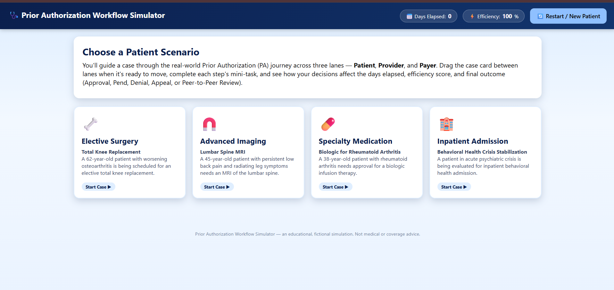
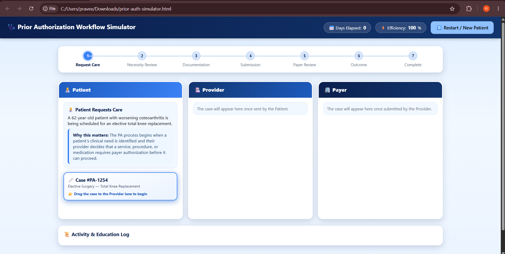
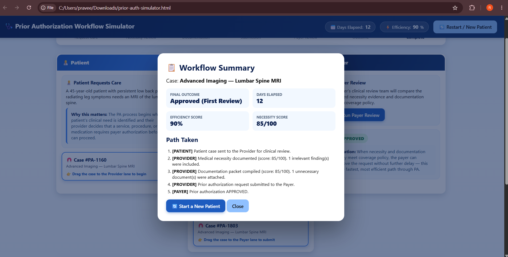
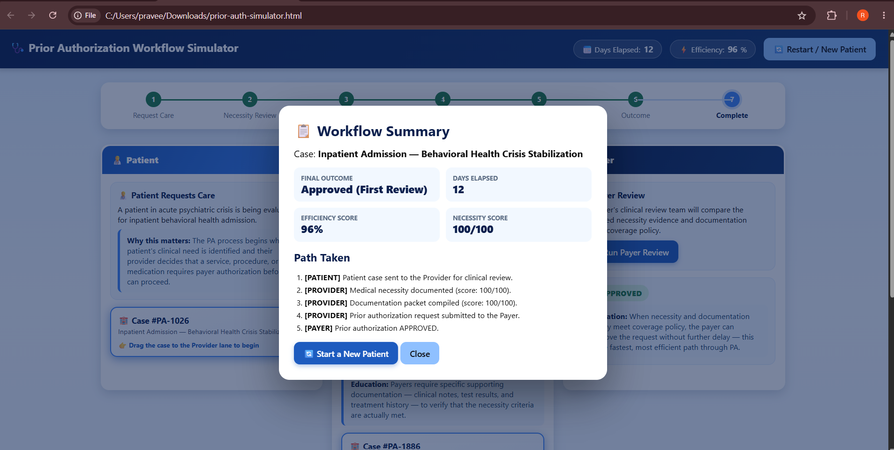

# Day 26 – Business Workflow Simulation with Claude

## Prior Authorization Workflow Simulator

For Day 26 of the #60DayClaudeChallenge, I built an interactive Prior Authorization Workflow Simulator using Claude.

The goal of this project was to understand how a healthcare business workflow can be represented as an interactive simulation while learning the basic stages involved in the US Prior Authorization process.

## Features

- Patient, Provider, and Payer workflow lanes
- Four patient scenarios
  - Elective Surgery
  - Advanced Imaging
  - Specialty Medication
  - Inpatient Admission
- Drag-and-drop case movement
- Medical necessity evaluation
- Prior Authorization documentation collection
- Payer review
- Approval, Pend, Denial, Appeal, and Peer-to-Peer Review paths
- Progress tracker
- Days elapsed counter
- Efficiency score
- Workflow summary
- Restart / New Patient functionality

## Screenshots

### 1. Patient Scenario Selection

The simulator provides four different healthcare scenarios that can be selected to begin the workflow.

### 2. Prior Authorization Workflow

After selecting a case, the workflow is organized into Patient, Provider, and Payer lanes. The progress tracker shows each stage of the authorization process.

### 3. Advanced Imaging – Approved Workflow

I completed the Advanced Imaging – Lumbar Spine MRI scenario.

The request was approved on the first review with an efficiency score of 90% and a medical necessity score of 85/100.

### 4. Inpatient Admission – Approved Workflow

I also tested the Inpatient Admission – Behavioral Health Crisis Stabilization scenario.

The request was approved on the first review with a 96% efficiency score and a 100/100 medical necessity score.

## Key Learning

One important thing I learned is that Prior Authorization is not simply an approval or denial step. It is a workflow involving the patient, healthcare provider, and payer.

The quality of medical necessity evidence and supporting documentation can influence the review process and may lead to approval, pend, denial, appeal, or Peer-to-Peer Review.

## Technical Learning

This challenge also helped me understand how Vanilla JavaScript can be used to manage a multi-stage workflow, drag-and-drop interactions, scoring, dynamic UI updates, and multiple scenarios without using a backend or framework.

## Built With

- HTML
- CSS
- Vanilla JavaScript
- Claude

## Challenge

Day 26 – Business Workflow Simulation with Claude  
#60DayClaudeChallenge
