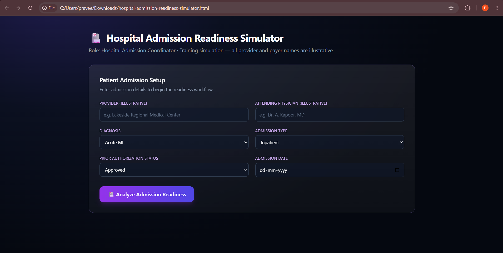
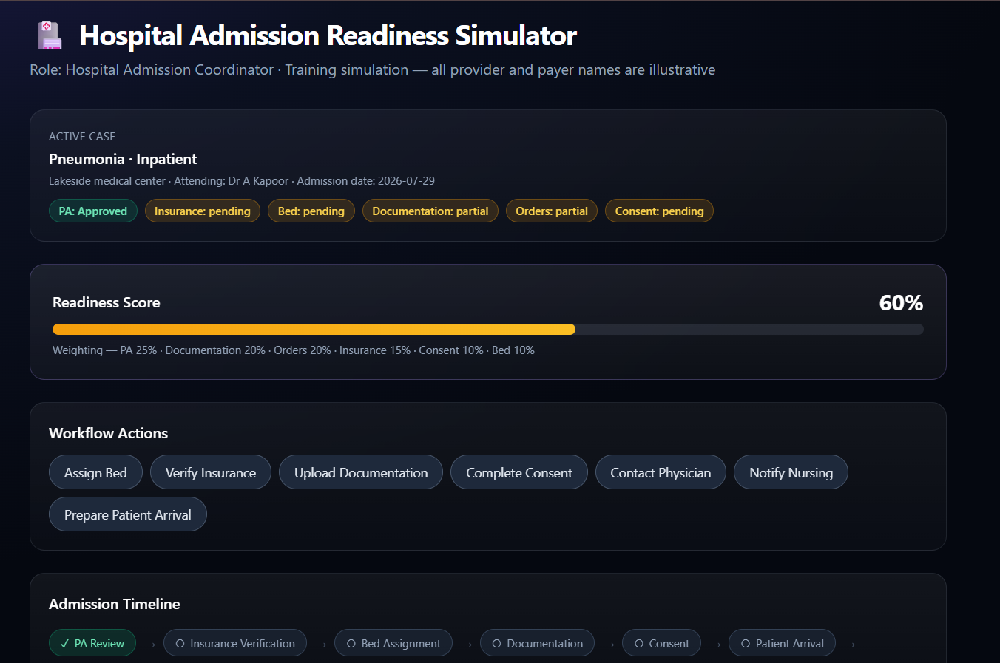
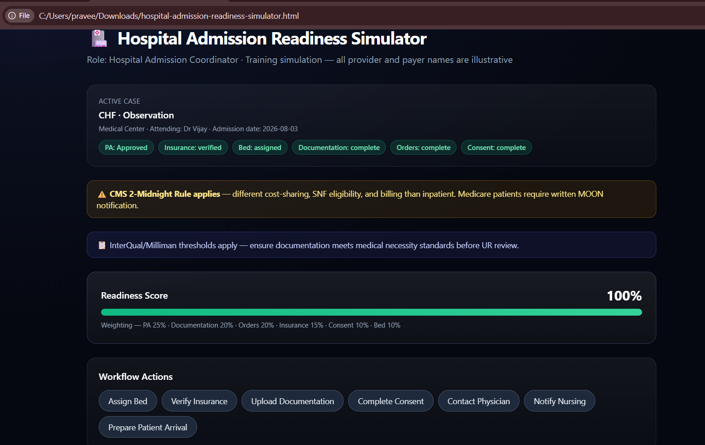
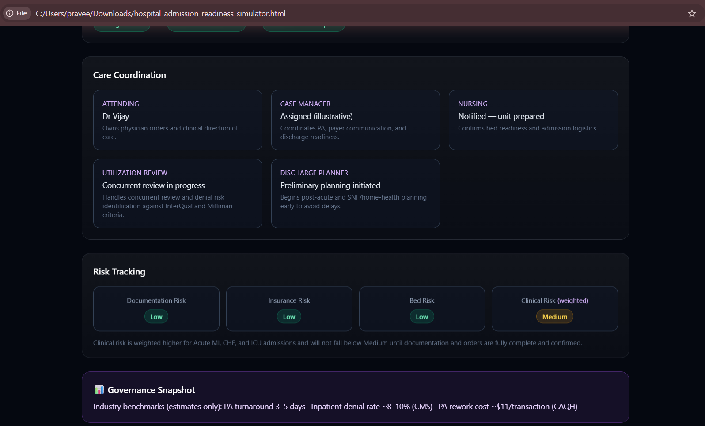
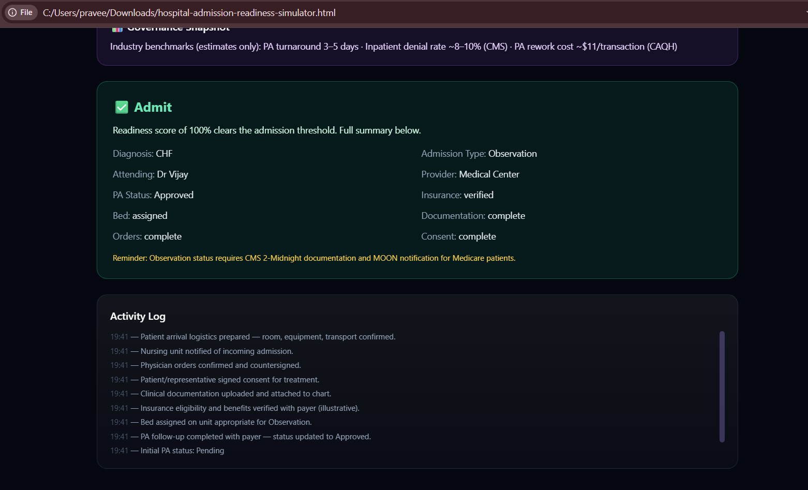

# 🏥 Day 28 – Hospital Admission Readiness Simulator

## #60DayClaudeChallenge

### 📌 Challenge
For Day 28, I used Claude to build a Hospital Admission Readiness Simulator as an interactive single-file HTML application.

The goal was to understand how hospital admission readiness depends on coordination between Prior Authorization, insurance verification, clinical documentation, physician orders, consent, bed availability, and care teams.

---

## 🏥 About the Simulator

The user plays the role of a Hospital Admission Coordinator and prepares a patient for admission.

The simulator supports different:

- Diagnoses such as Acute MI, CHF, Pneumonia, Elective Surgery, and Hip Fracture
- Admission types including Inpatient, Observation, Emergency, ICU, and Same-Day Surgery
- Prior Authorization states such as Approved, Pending, and Denied

The application calculates an Admission Readiness Score and allows workflow actions to improve readiness before making the final admission decision.

---

## ⚙️ Key Features

- Hospital admission setup
- Prior Authorization workflow
- Insurance verification
- Bed assignment
- Documentation tracking
- Physician order tracking
- Patient consent
- Care coordination
- Risk tracking
- Admission readiness scoring
- Governance snapshot
- Final Admit / Not Ready decision
- Restart and scenario testing

---

## 🔄 Admission Workflow

The simulated admission journey follows:

PA Review → Insurance Verification → Bed Assignment → Documentation → Consent → Patient Arrival → Registration → Clinical Assessment → Admission Complete

The readiness score considers:

- PA Status – 25%
- Clinical Documentation – 20%
- Physician Orders – 20%
- Insurance – 15%
- Consent – 10%
- Bed – 10%

---

## 💡 Key Insights

One important insight from this task was that hospital admission readiness is not based on a single administrative step.

Even when a patient requires admission, factors such as Prior Authorization, medical necessity documentation, physician orders, insurance verification, consent, and bed availability must be coordinated.

I also learned how workflow simulations can make complex healthcare operations easier to understand by turning individual processes into interactive decisions.

---

## 🧠 What I Learned

- How Prior Authorization affects hospital admission workflows
- How multiple teams coordinate before an admission
- How documentation and insurance issues create operational risk
- How readiness scoring can represent workflow completion
- How risk levels can change based on clinical scenarios
- How Claude can generate interactive educational applications using HTML and JavaScript

---

## 🛠️ Technologies Used

- HTML
- Tailwind CSS
- Vanilla JavaScript
- Claude

---

## 📸 Screenshots

### 1. Admission Setup

### 2. Initial Readiness Analysis

### 3. Admission Workflow

### 4. Governance Snapshot

### 5. Final Admission Decision

---

## 📂 Files

- `hospital-admission-readiness-simulator.html` – Complete interactive application
- `day28.md` – Challenge documentation
- `screenshots/` – Screenshots demonstrating the simulator workflow

---

## 🚀 Day 28 Complete

Completed as part of the ABTalks 60-Day Claude Challenge.

#60DayClaudeChallenge
