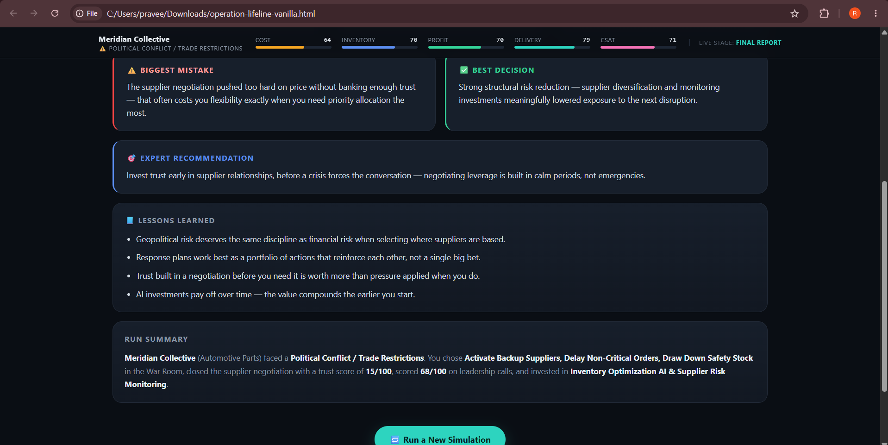

# Day 29 – Operation Lifeline: Supply Chain Crisis Lab

## 60 Days of Claude Challenge

### Project Overview

For Day 29, I built **Operation Lifeline: Supply Chain Crisis Lab**, an interactive browser-based simulation where the user takes control of a global company during a supply chain crisis.

The simulation challenges the user to make decisions across crisis response, supplier negotiation, leadership, risk management, and AI investment.

The application was built as a single HTML file using HTML, CSS, and Vanilla JavaScript.

---

## Features

- Randomized company and crisis scenarios
- Live operational metrics
- Company and crisis briefing
- War Room crisis-response decisions
- Supplier negotiation
- Boardroom leadership decisions
- AI strategy investments
- Final Crisis Score
- Leadership, negotiation, resilience, cost control, risk management, and customer satisfaction scores
- Best decision and biggest mistake analysis
- Expert recommendation
- Lessons learned
- New simulation/replay functionality

---

## Simulation Screenshots

### 1. Operation Lifeline – Start Screen

The simulation begins by introducing the supply chain crisis environment and the decisions the player will face.

### 2. Company Profile

In this simulation, I managed **Meridian Collective**, an automotive parts company. The company profile provides operational information such as revenue, factories, warehouses, suppliers, inventory, lead time, and countries of operation.

### 3. AI Strategy

One of the final challenges was deciding which AI technologies should be funded to improve future supply chain resilience.

The available options included Demand Forecasting AI, Inventory Optimization AI, Supplier Risk Monitoring, Warehouse Vision, and Procurement Copilot.

### 4. Final Crisis Score

My final **Overall Crisis Score was 79/100 – Solid**.

Key results:

- Leadership: 68/100
- Negotiation: 52/100
- Resilience: 95/100
- Cost Control: 79/100
- Risk Management: 100/100
- Customer Satisfaction: 79/100

### 5. Lessons Learned & Run Summary

The simulator identified supplier negotiation as my biggest weakness while highlighting supplier diversification and monitoring investments as a strong decision.

---

## Key Learnings

This simulation helped me understand that supply chain crisis management is not only about reducing immediate costs.

I learned that:

- Supplier diversification can significantly improve resilience.
- Strong supplier relationships and trust matter during negotiations.
- Crisis response requires balancing cost, inventory, delivery, profit, and customer satisfaction.
- Geopolitical risks should be considered when designing supply networks.
- AI-based forecasting, inventory optimization, and supplier monitoring can improve long-term resilience.
- Good crisis management requires a portfolio of coordinated decisions rather than one isolated action.

---

## Tech Stack

- HTML
- CSS
- Vanilla JavaScript
- Claude

---

## Challenge

Day 29 of the **#60DayClaudeChallenge**

Built as part of the ABTalks 60-Day Claude Challenge.
