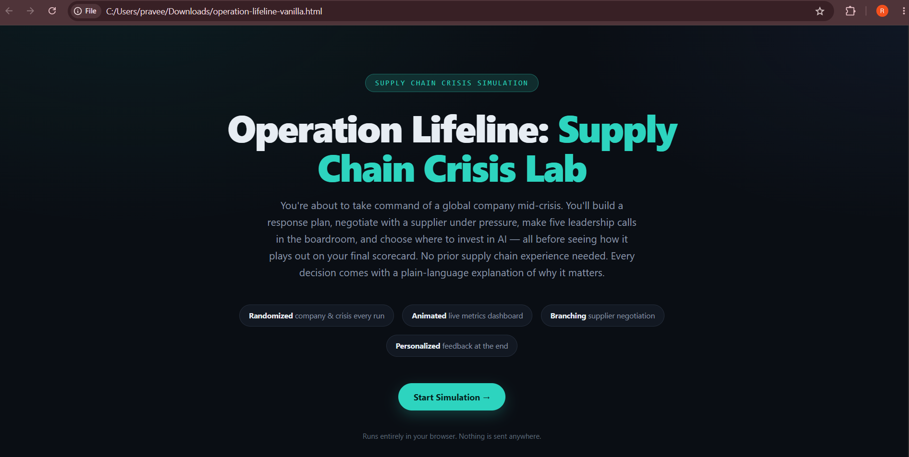
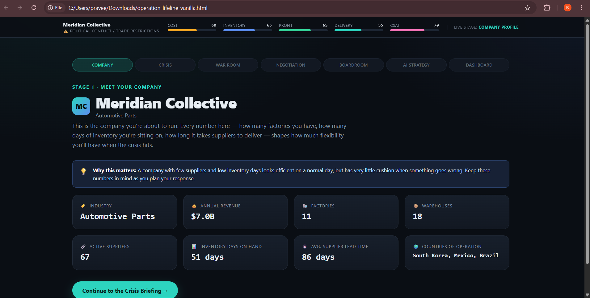
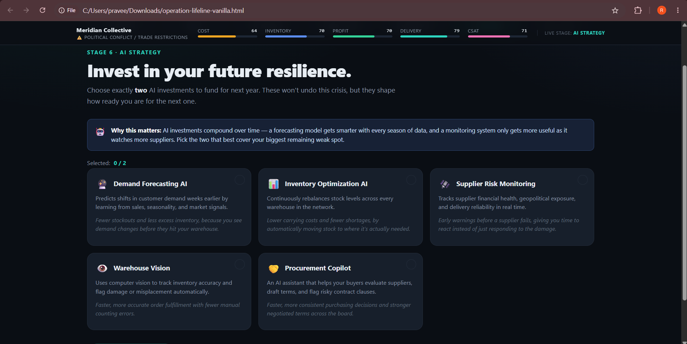
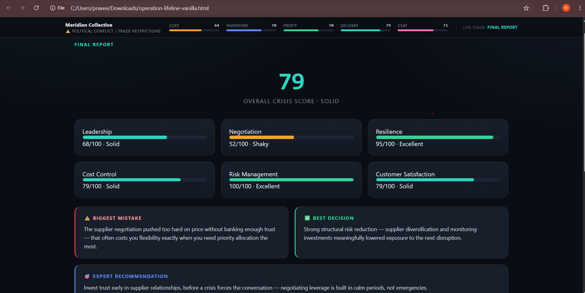

# Day 29 – Operation Lifeline: Supply Chain Crisis Lab 🚨

## ABTalks 60-Day Claude Challenge

For Day 29, I built and explored **Operation Lifeline: Supply Chain Crisis Lab**, an interactive enterprise business simulation created with Claude.

The challenge focuses on making strategic decisions during a supply-chain crisis and observing how those decisions affect business outcomes.

## 🎯 Objective

The goal was to experience enterprise crisis management through an interactive simulation and understand how leaders must balance competing priorities when supply-chain disruptions occur.

## 🚨 Crisis Scenario

**Biggest Crisis:** [Add your actual crisis]

**Strategy Chosen:** [Add the strategy you selected]

**Final Crisis Score:** [Add your actual score]

## 🧠 Decisions & Strategy

During the simulation, I had to evaluate the crisis, review available information, choose a response strategy, and observe the impact of those decisions.

The experience demonstrated how business decisions during a crisis can involve trade-offs rather than having one perfect solution.

## 📊 Executive Dashboard

The executive dashboard helped visualize the status and impact of the crisis throughout the simulation.

## 📸 Simulation Screenshots

### Crisis Beginning

### Major Crisis

### Strategic Decision

### Final Result

## 💡 Key Learnings

- Learned how interactive simulations can represent enterprise crisis situations.
- Understood the importance of evaluating risks before making strategic decisions.
- Learned that crisis management involves balancing multiple business priorities.
- Explored how an executive dashboard can support decision-making.
- Learned how Claude can be used to build interactive enterprise simulations.

## 🛠️ Tools Used

- Claude AI
- HTML
- CSS
- JavaScript
- GitHub

## 🚀 Challenge

**Day 29 – Operation Lifeline: Supply Chain Crisis Lab**

#60DayClaudeChallenge
