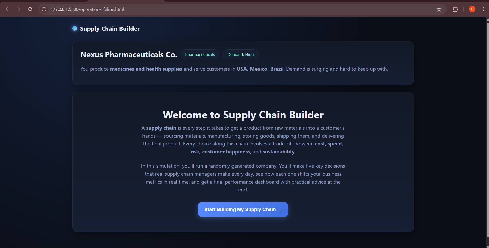
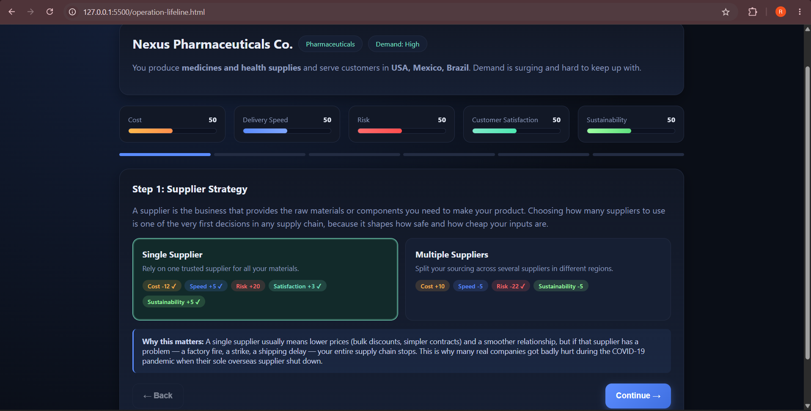
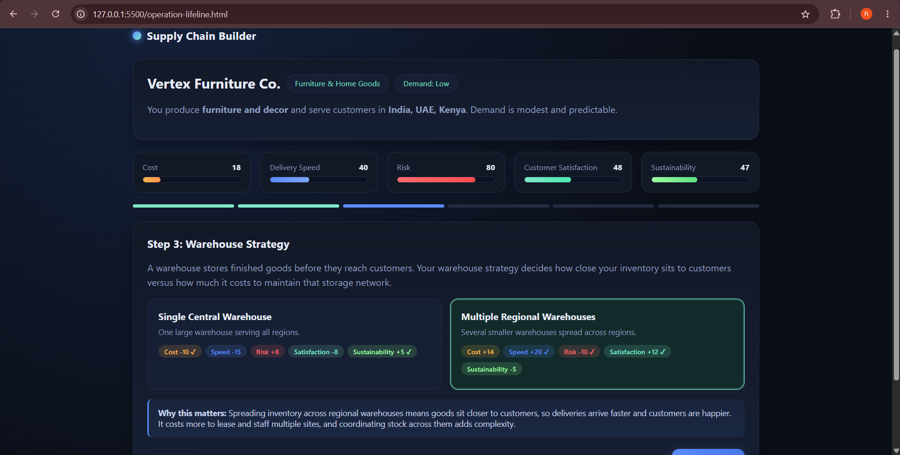
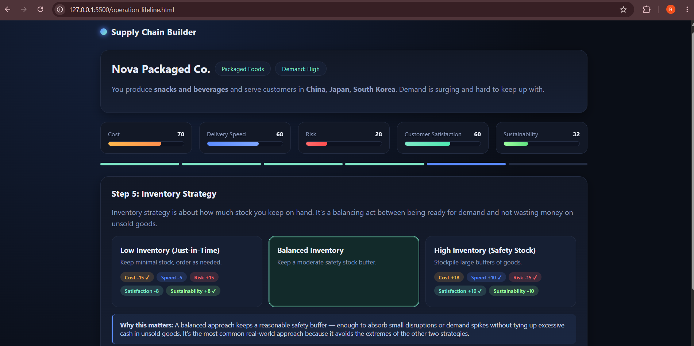
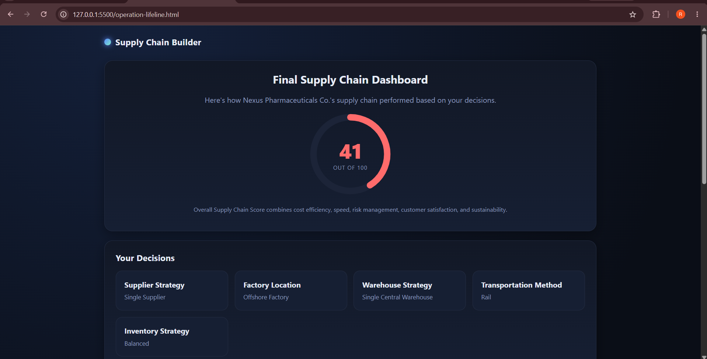

# 📦 Day 30 – Supply Chain Builder

## 60 Days of Claude Challenge

### 🚀 Supply Chain Optimization with Claude

For Day 30 of the #60DayClaudeChallenge, I built **Supply Chain Builder**, an interactive supply chain optimization simulator that helps beginners understand how operational decisions affect business performance.

The application generates randomized company scenarios and guides the user through five major supply chain decisions while updating business metrics in real time.

---

## 🎯 Project Objective

The goal was to understand how supply chain leaders balance:

- Cost
- Delivery Speed
- Risk
- Customer Satisfaction
- Sustainability

Instead of only reading about supply chain concepts, this simulator allows users to make decisions and immediately observe their impact.

---

## 🛠️ Features

- Randomly generated company scenarios
- Beginner-friendly supply chain explanations
- Supplier strategy selection
- Factory location selection
- Warehouse strategy selection
- Transportation method selection
- Inventory strategy selection
- Trade-off explanation after each decision
- Live business metrics
- Final Supply Chain Score
- Decision summary
- Strengths and weaknesses analysis
- Biggest risk identification
- Practical improvement recommendations
- Replay functionality for testing different strategies

---

## 📸 Screenshots

### 1. Welcome & Company Scenario

The simulator begins by introducing supply chain concepts in simple language and generates a randomized company scenario.

---

### 2. Supplier Strategy

The first major decision is choosing between a single supplier and multiple suppliers.

The simulator explains how a single supplier may reduce cost and simplify operations but can increase dependency risk.

---

### 3. Warehouse Strategy

Warehouse decisions demonstrate the trade-off between centralized operations and multiple regional warehouses.

Regional warehouses can improve delivery speed and customer satisfaction, while increasing operating costs and complexity.

---

### 4. Inventory Strategy & Live Metrics

The simulator continuously updates:

- Cost
- Delivery Speed
- Risk
- Customer Satisfaction
- Sustainability

This helped me understand that every operational decision can improve some metrics while negatively affecting others.

---

## 🏆 Final Supply Chain Dashboard

For the documented final run, the generated company was **Nexus Pharmaceuticals Co.**

### Overall Supply Chain Score: 41/100

### My Final Decisions

| Decision | Choice |
|---|---|
| Supplier Strategy | Single Supplier |
| Factory Location | Offshore Factory |
| Warehouse Strategy | Single Central Warehouse |
| Transportation Method | Rail |
| Inventory Strategy | Balanced Inventory |

The score showed that choosing individually attractive options does not necessarily create a strong overall supply chain.

---

## 🔄 Multiple Scenario Testing

I also replayed the simulator with different randomly generated companies, including scenarios in pharmaceuticals, furniture and home goods, and packaged foods.

This demonstrated how the same supply chain strategy may not be suitable for every company because demand, products, markets, and operational priorities can differ.

---

## 💡 Key Learnings

One of my biggest learnings from this simulation was that **supply chain optimization is about balancing trade-offs rather than maximizing one metric**.

A single supplier may offer lower cost and simpler coordination, but it creates dependency on one source.

Multiple regional warehouses can improve delivery speed and customer satisfaction, but they may increase cost and operational complexity.

Inventory strategy also requires balance. Keeping too little inventory can increase disruption risk, while keeping too much can tie up money in stock.

The simulation helped me see how supplier, factory, warehouse, transportation, and inventory decisions are interconnected.

---

## 📚 What I Learned

- How supplier strategy affects cost and risk
- How factory location influences overall supply chain performance
- How warehouse strategy affects delivery speed and customer satisfaction
- How transportation involves trade-offs between speed, cost, and sustainability
- How inventory levels affect resilience and efficiency
- How operational decisions influence multiple business metrics simultaneously
- Why supply chain optimization requires balancing competing priorities

---

## 💻 Tech Stack

- HTML
- CSS
- JavaScript
- React
- Claude

---

## 🎯 Final Takeaway

My final score of **41/100** was a useful result because it showed that supply chain decisions need to be evaluated as a complete system.

The goal is not simply to minimize cost or maximize speed. A strong supply chain needs the right balance of **efficiency, resilience, customer experience, and sustainability**.

---

## 🔗 Challenge

**Day 30 – Supply Chain Optimization with Claude**

Part of the **#60DayClaudeChallenge** by ABTalks.
