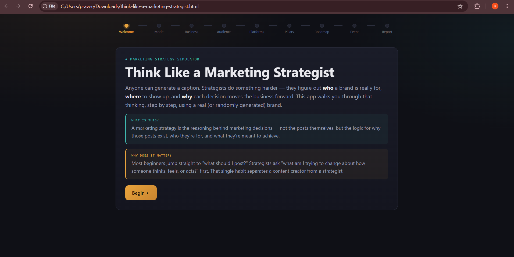
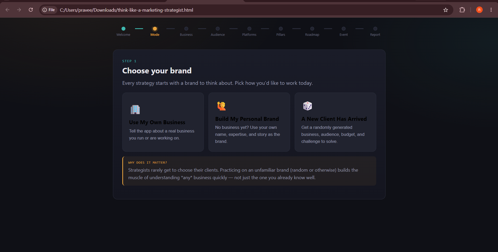
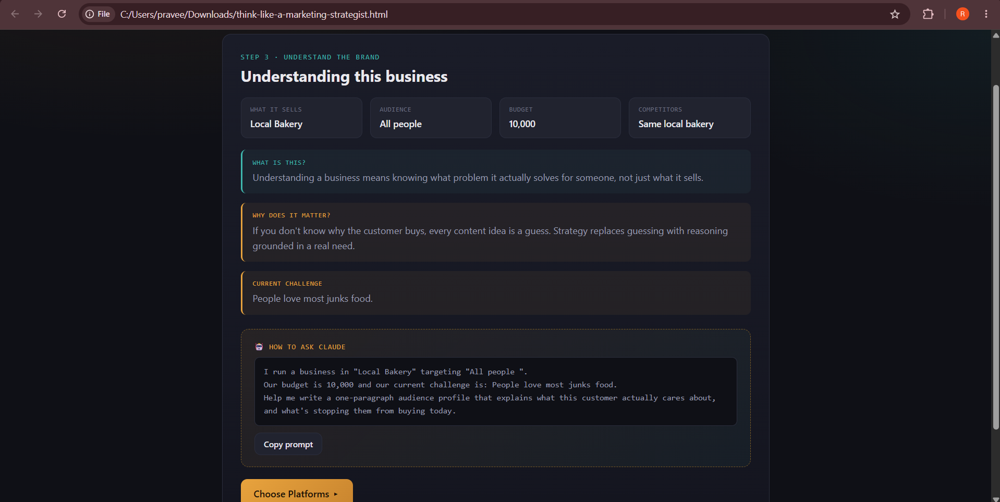
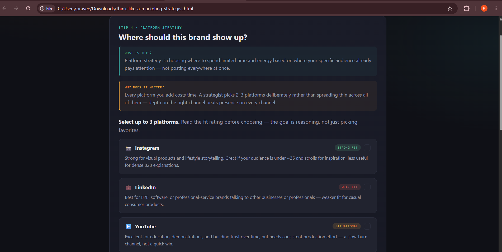
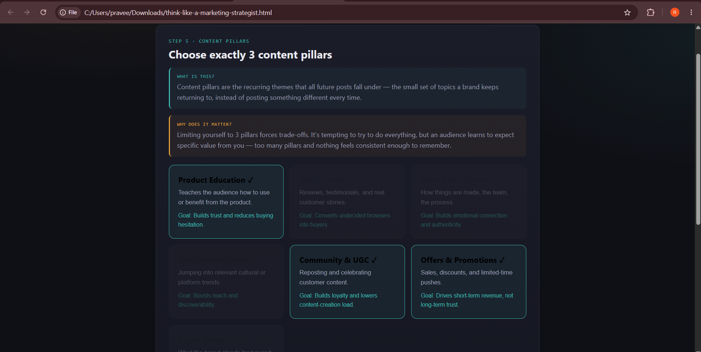
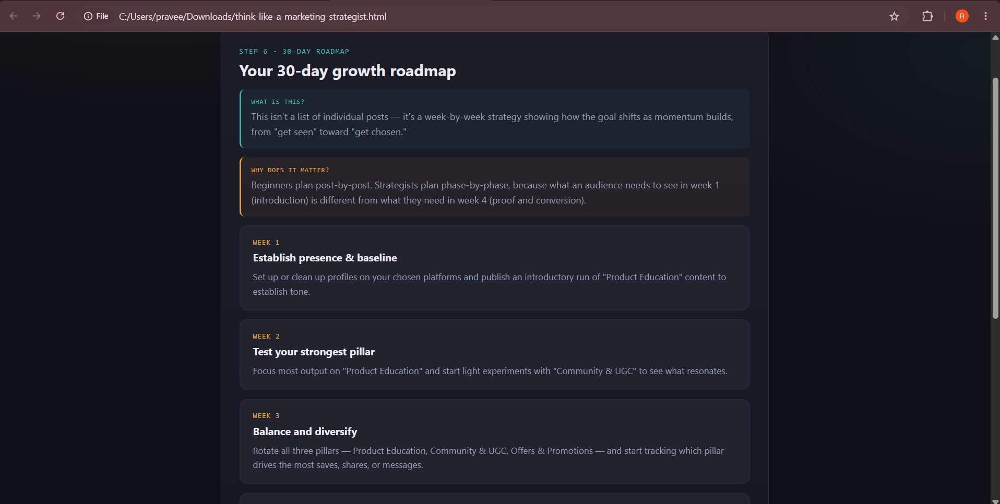
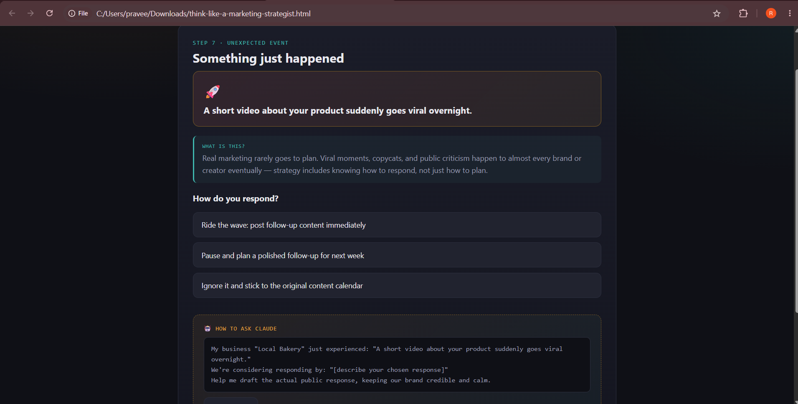
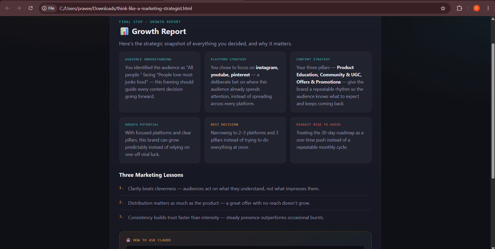

# Day 32 – Marketing Strategy with Claude

## Project
Think Like a Marketing Strategist: Grow This Brand

## Overview

Today I built an interactive marketing strategy learning simulator using React, HTML, CSS, and JavaScript.

The application teaches strategic marketing thinking by guiding users through the complete marketing planning process instead of simply generating marketing content.

Users can create strategies for:

- A real business
- Their personal brand
- A randomly generated client

The simulator explains every decision with simple reasoning and also teaches reusable Claude prompt engineering techniques.

---

## Features

- Interactive React Application
- Three Strategy Modes
- Audience Analysis
- Platform Selection
- Content Pillar Planning
- 30-Day Marketing Roadmap
- Random Marketing Challenges
- Growth Report
- Reusable Claude Prompt Cards
- Responsive Dark UI

---

## Screenshots

### Welcome Screen

### Brand Selection

### Audience Analysis

### Platform Strategy

### Content Pillars

### Marketing Roadmap

### Marketing Challenge

### Growth Report

---

## Technologies Used

- React (CDN)
- HTML5
- CSS3
- JavaScript

---

## Key Learnings

- Marketing begins with understanding people, not creating content.
- Different platforms serve different marketing goals.
- Content pillars help maintain consistency.
- Long-term strategy is more effective than random posting.
- Prompt engineering can improve marketing planning with AI.

---

## Challenge Completed

Day 32 of the **60 Days Claude AI Challenge** by ABTalks.
