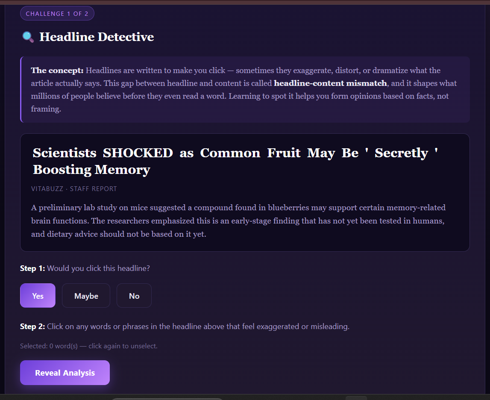
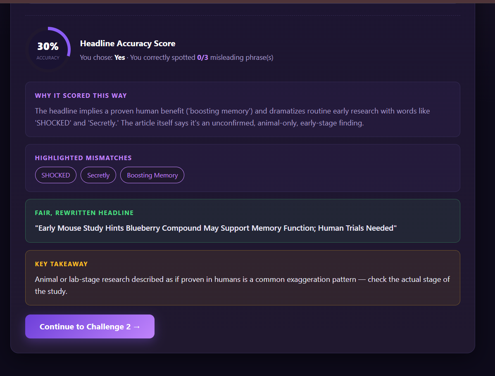
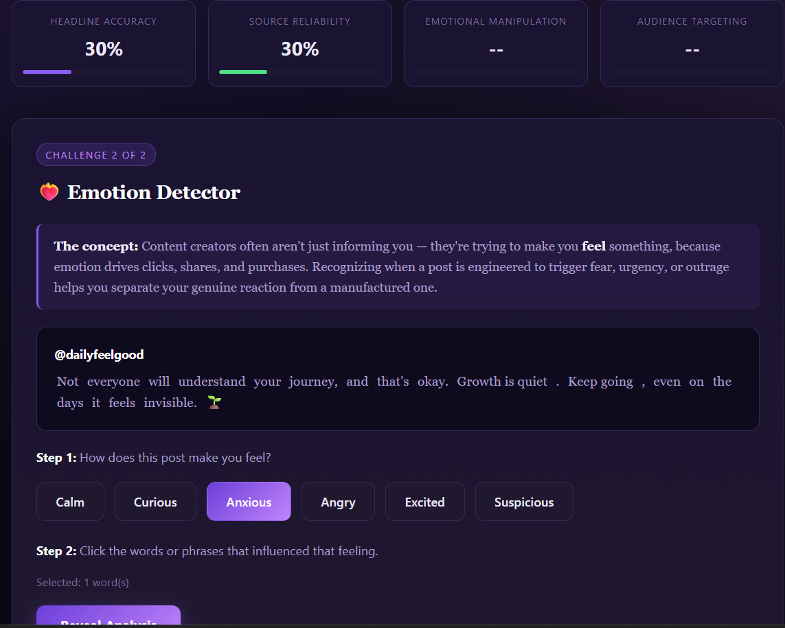
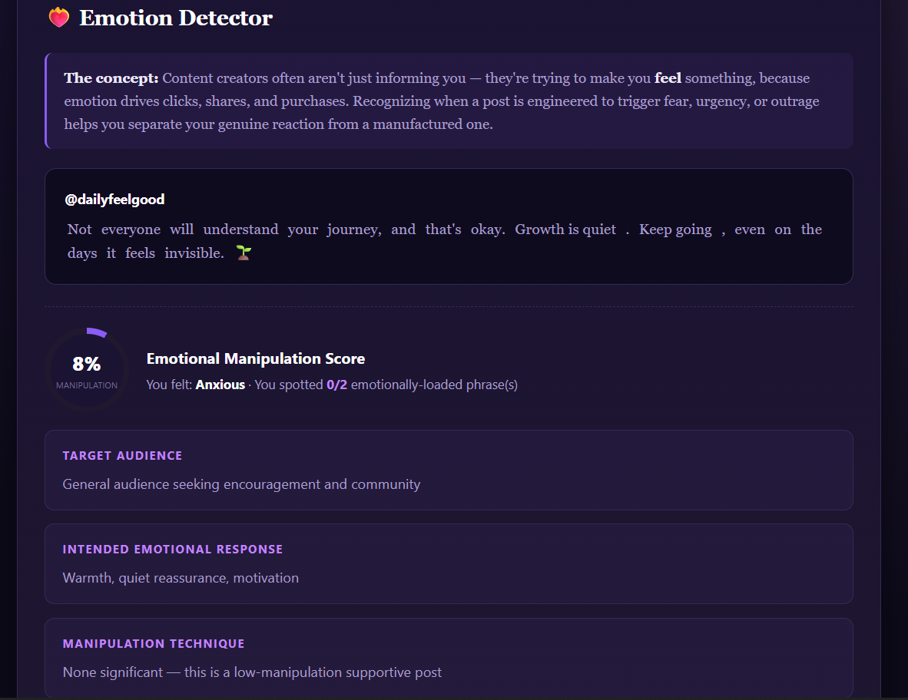
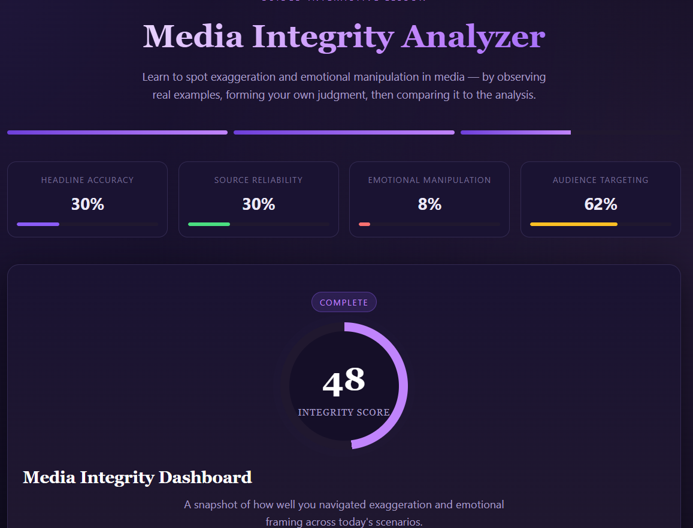

# Day 33 – Media Literacy with Claude

## Project

Media Integrity Analyzer

---

## Overview

Today I built an interactive educational application called **Media Integrity Analyzer** using HTML, CSS, and JavaScript.

The application teaches media literacy by helping users identify misleading headlines, emotional manipulation, and audience targeting through guided interactive challenges.

Instead of testing prior knowledge, the application encourages users to think critically before revealing the analysis.

---

## Features

- Interactive Headline Detective
- Emotion Detector Challenge
- Live Media Integrity Metrics
- Headline Accuracy Analysis
- Emotional Manipulation Detection
- Audience Targeting Insights
- Neutral Content Rewrites
- Media Integrity Dashboard
- Replay with Random Scenarios
- Responsive Offline Design

---

## Technologies Used

- HTML5
- CSS3
- JavaScript

---

## Screenshots

### Theme Selection

### Headline Detective

### Headline Analysis

### Emotion Detector

### Emotion Analysis

### Media Integrity Dashboard

---

## Key Learnings

- Headlines can exaggerate facts to attract attention.
- Emotional language influences how people react before they think.
- Source credibility should always be verified.
- Reading beyond the headline improves critical thinking.
- AI can create engaging educational simulations for learning media literacy.

---

## Challenge Completed

Day 33 of the **60 Days Claude AI Challenge** by ABTalks.
