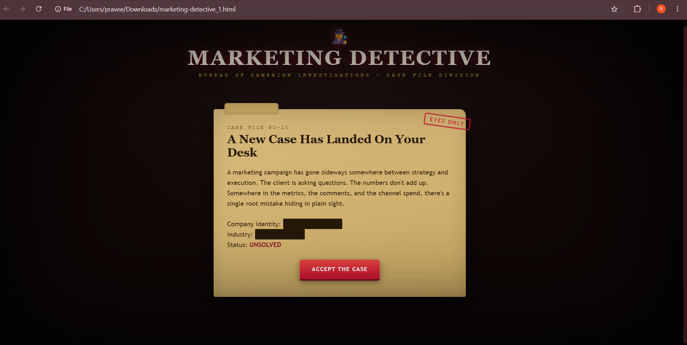
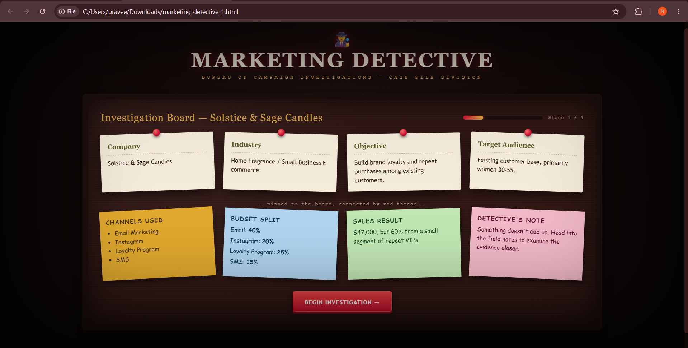
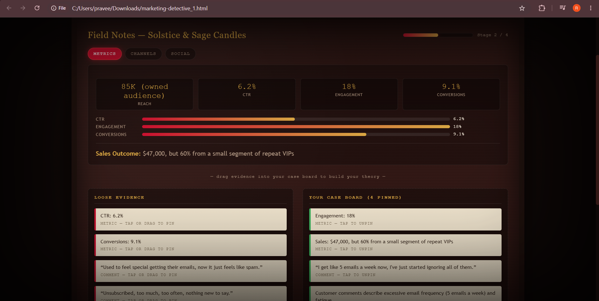
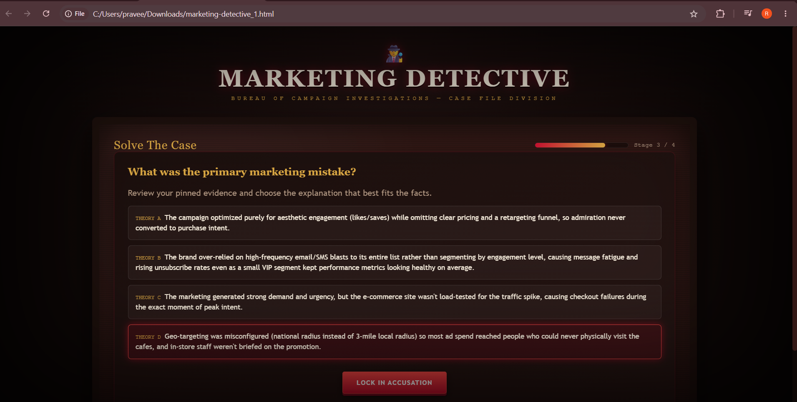
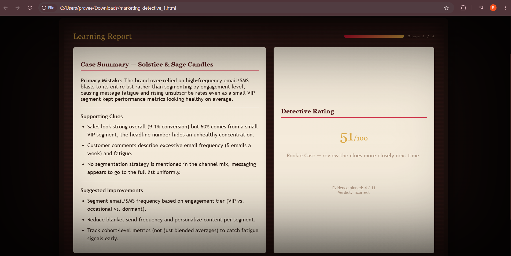

# Day 34 – Marketing Detective

## Challenge

Built an interactive **Marketing Detective** application using Claude AI.

The application teaches marketing analytics through detective-style investigations where users analyze campaign evidence, identify marketing mistakes, and learn data-driven decision making.

---

## Features

- Dark Detective UI
- Theme Selection
- Random Marketing Cases
- Interactive Investigation Board
- Draggable Evidence Cards
- Campaign Metrics Analysis
- Customer Comments Analysis
- Marketing Mistake Detection
- Expert Verdict
- Learning Report
- Replay with New Cases
- Responsive Single HTML Application

---

## Technologies Used

- HTML5
- CSS3
- JavaScript
- Claude AI

---

## Screenshots

### Welcome Screen

### Investigation Board

### Evidence Analysis

### Solved Marketing Case

### Learning Report

---

## Generated HTML File

- marketing-detective.html

---

## Marketing Learning Report

### Investigation Summary

- Campaign performance analyzed
- Marketing evidence reviewed
- Primary marketing mistake identified
- Expert recommendations generated

---

## Key Learnings

- Marketing decisions should be based on evidence rather than assumptions.
- Customer behavior provides valuable campaign insights.
- Marketing metrics help identify weak campaign areas.
- Data-driven improvements increase campaign effectiveness.
- Claude AI can generate interactive educational applications with real-world business scenarios.

---

## Project Outcome

Successfully created an interactive Marketing Detective simulator that improves analytical thinking and marketing decision-making through hands-on investigation.

---

#60DayClaudeChallenge
