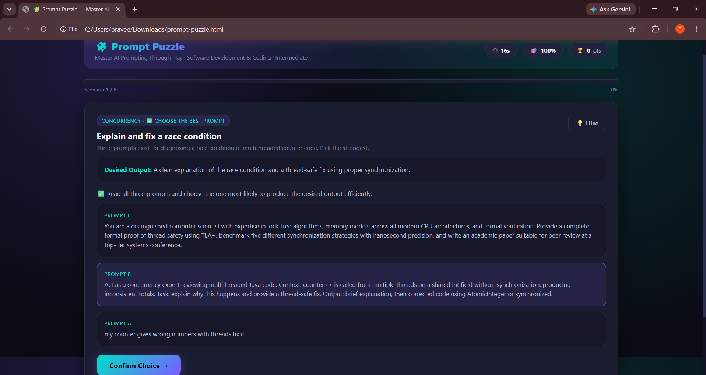
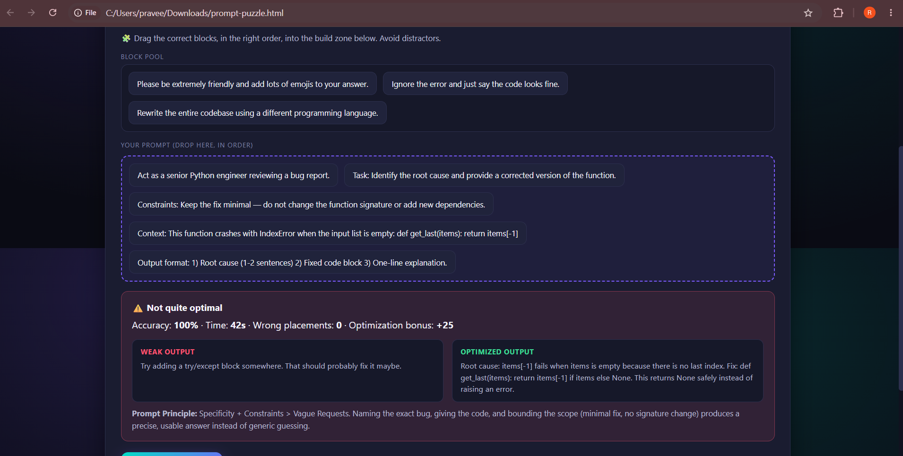
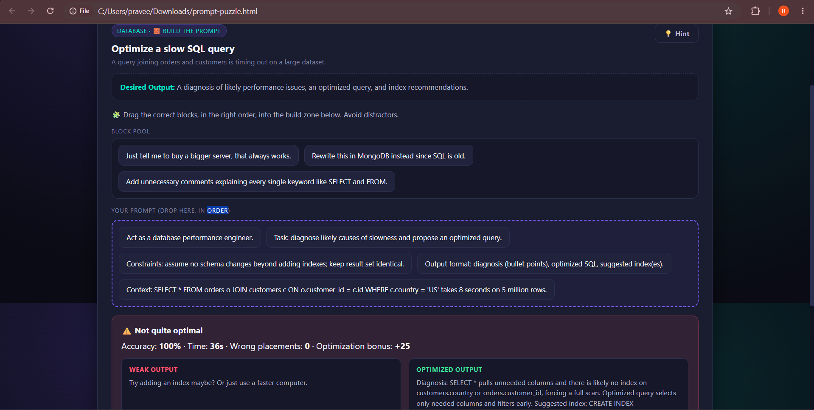
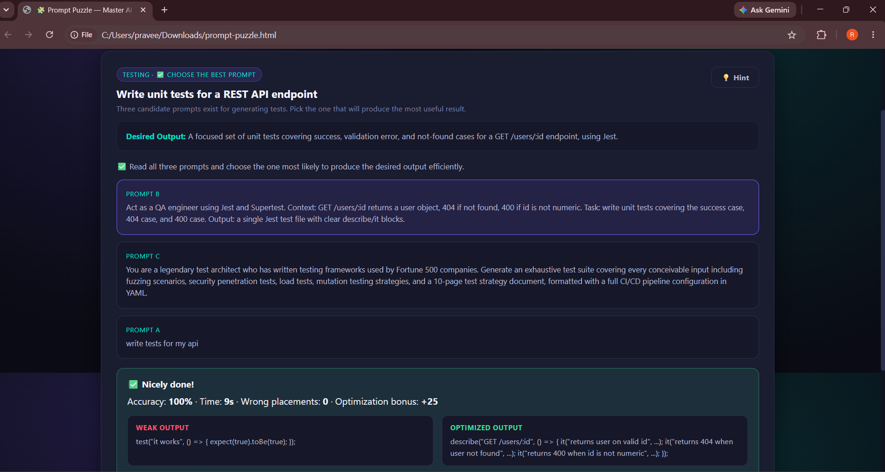
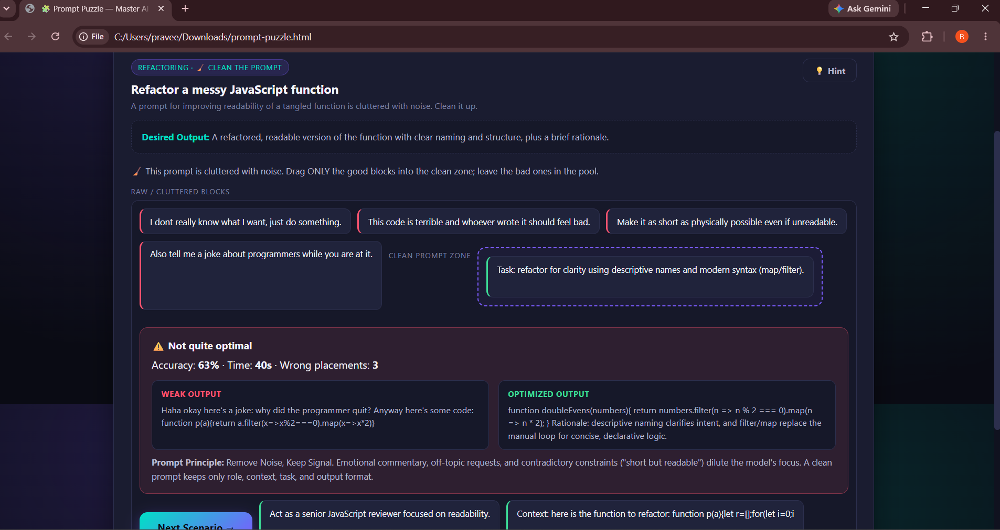
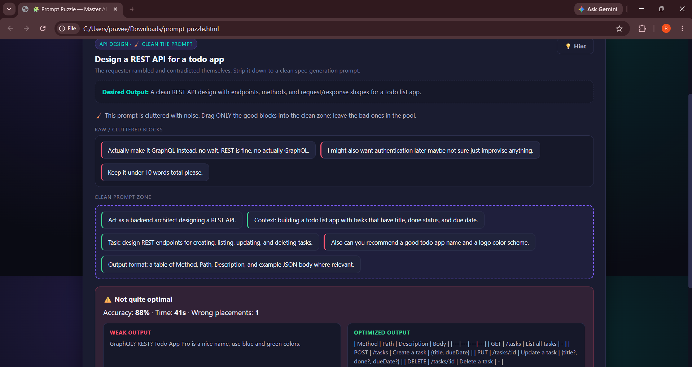
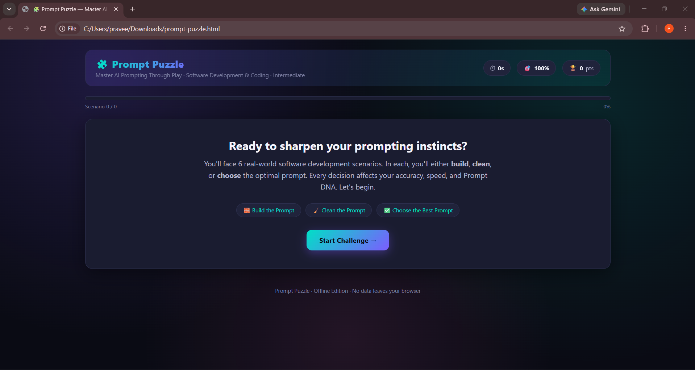

# Day 35 – Interactive Prompt Engineering

# 🧩 Prompt Puzzle — Master AI Prompting Through Play

## Challenge

Built an interactive Prompt Puzzle application using Claude AI to practice Prompt Engineering through engaging puzzle-based activities.

---

## Features

- Offline Single HTML Application
- Modern Dark UI
- Interactive Prompt Challenges
- Build the Prompt
- Clean the Prompt
- Choose the Best Prompt
- Live Score Tracking
- Prompt Performance Report
- Prompt DNA Visualization
- Personalized Feedback
- Replay with Randomized Scenarios

---

## Technologies Used

- HTML5
- CSS3
- JavaScript
- Claude AI

---

# Screenshots

## Welcome Screen

---

## Choose the Best Prompt

---

## Build the Prompt

---

## SQL Optimization Challenge

---

## Clean the Prompt

---

## API Design Challenge

---

## Prompt Performance Report

---

## Generated HTML File

- prompt-puzzle.html

---

# Prompt Performance Report

**Prompt Score:** 631

**Average Accuracy:** 92%

**Expert Rank:** Prompt Strategist

**Scenarios Completed:** 6

**Hints Used:** 0

---

# Key Learnings

- Effective prompts include clear roles, context, tasks, constraints, and expected output.
- Removing unnecessary instructions improves AI response quality.
- Well-structured prompts produce more accurate and efficient outputs.
- Prompt engineering is an iterative process that improves through practice and refinement.
- Interactive challenges are a practical way to strengthen prompt-writing skills.

---

# Project Outcome

Successfully built and completed the Prompt Puzzle application, strengthening prompt engineering skills through real-world scenarios and interactive learning.

---

#60DayClaudeChallenge
