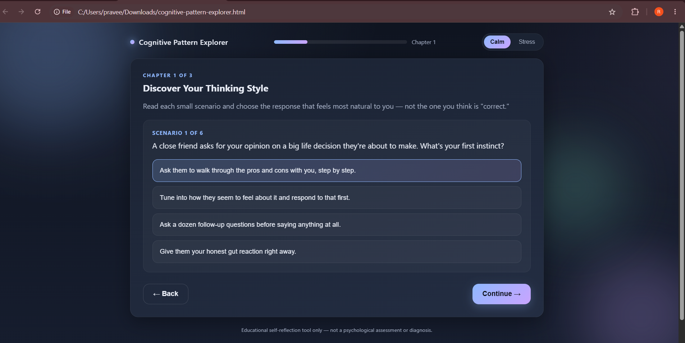
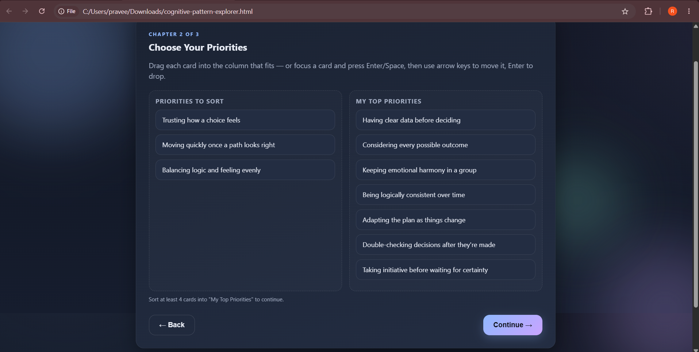
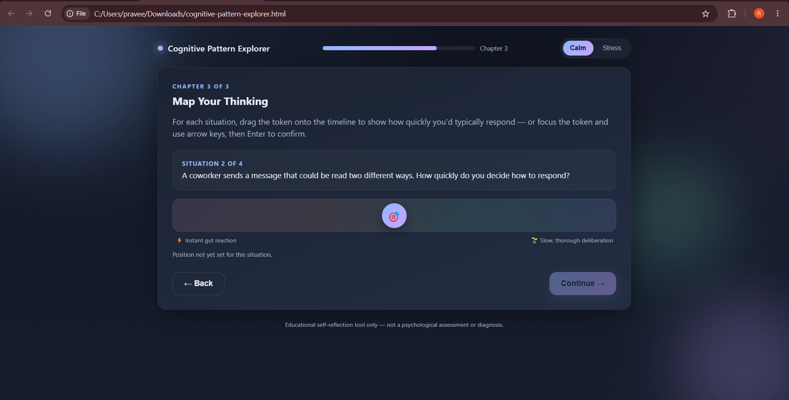

# Day 36 – Psychology-Inspired Interactive Learning with Claude

## Project
**Cognitive Pattern Explorer**

An interactive self-reflection web application created using Claude AI that helps users explore their thinking patterns through scenarios, priorities, and decision-making activities.

## Features
- Calm and Stress modes
- Interactive thinking style scenarios
- Drag-and-drop priority sorting
- Decision timeline mapping
- Personalized Reflection Journal
- Responsive UI with modern design

## Technologies Used
- HTML5
- CSS3
- JavaScript

## Screenshots

### Home Screen
01-dashboard.png)

### Thinking Style Quiz

### Priority Sorting

### Thinking Timeline

### Reflection Journal

## Key Learnings
- Learned how AI can generate complete interactive web applications.
- Understood how psychological concepts can be presented through engaging UI interactions.
- Explored drag-and-drop functionality and dynamic user interactions.
- Learned to design multi-step user experiences using HTML, CSS, and JavaScript.
- Gained experience building personalized reflection dashboards.
