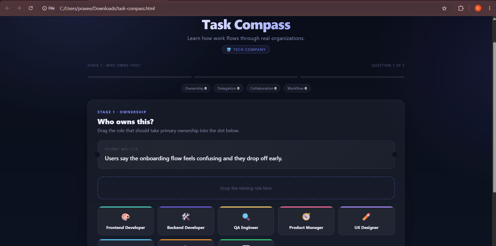
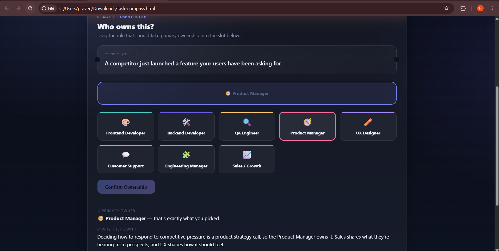
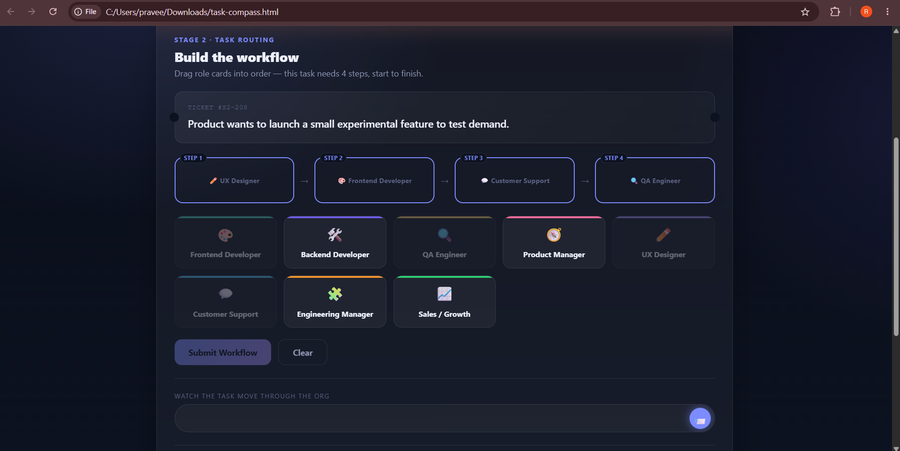
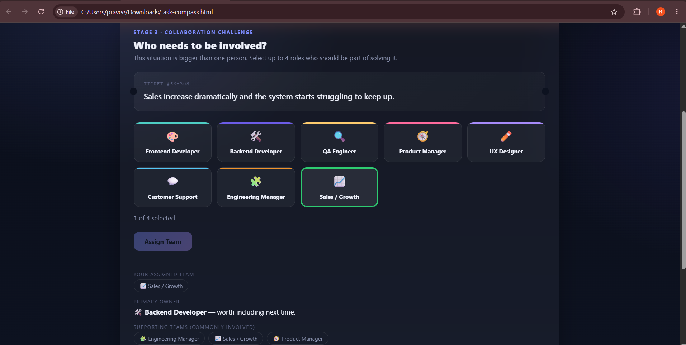
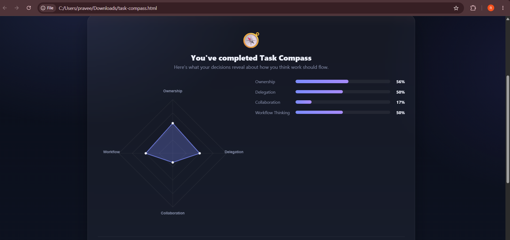
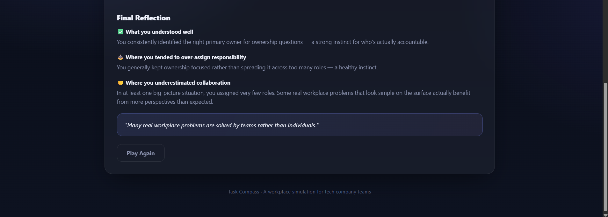

# Day 37 – Interactive Organizational Learning

## Project
# Task Compass

### Learn how work flows through real organizations.

Task Compass is an interactive educational web application that simulates how work moves through a modern tech company. Instead of testing job titles, it teaches ownership, delegation, workflow thinking, collaboration, and communication using realistic workplace scenarios.

## Features

- Three interactive learning stages
- Drag-and-drop role assignment
- Task workflow routing simulation
- Collaboration-based decision making
- Animated workplace ticket system
- Organizational Thinking Dashboard
- Radar chart visualization
- Personalized reflection and learning insights
- Responsive modern Glassmorphism UI
- Works completely offline

## Technologies Used

- HTML5
- CSS3
- Vanilla JavaScript

## Project Screenshots

### Home Screen

### Stage 1 – Who Owns This?

### Stage 2 – Task Routing

### Stage 3 – Collaboration Challenge

### Organizational Thinking Dashboard

### Final Reflection

## Key Learnings

- Learned how ownership differs from collaboration.
- Understood how work flows through different teams.
- Learned the importance of delegation instead of assigning everything to one person.
- Realized that complex workplace problems require multiple departments working together.
- Explored workflow thinking through realistic organizational scenarios.
- Improved understanding of communication and responsibility inside organizations.
