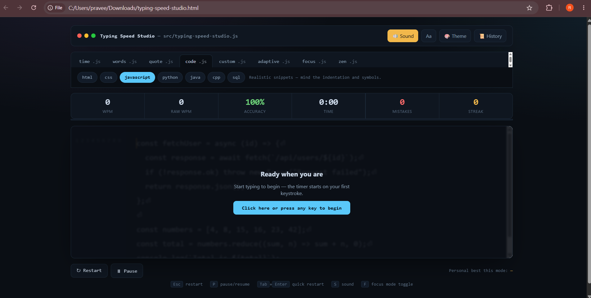
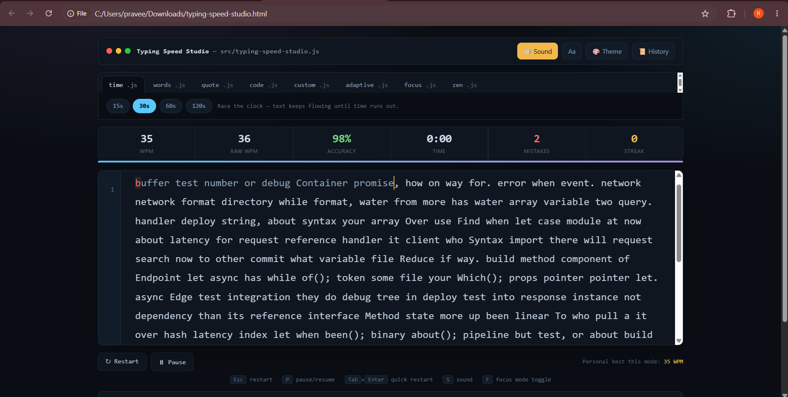
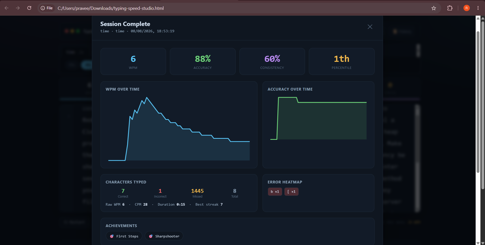
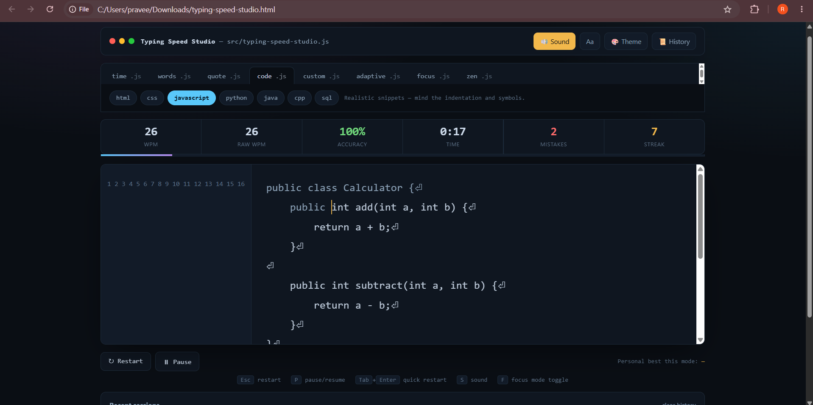
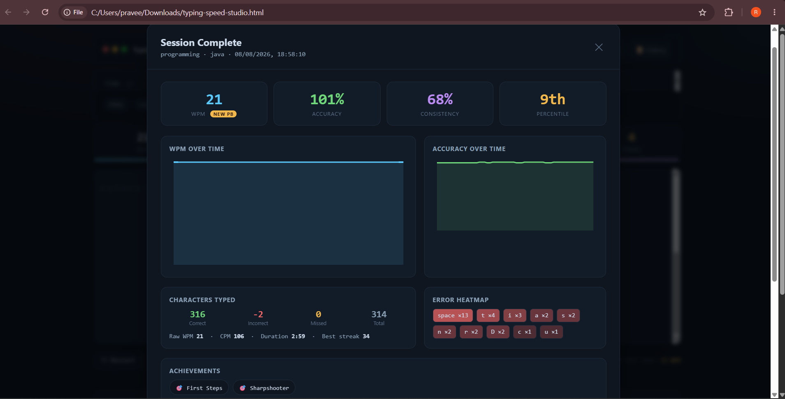
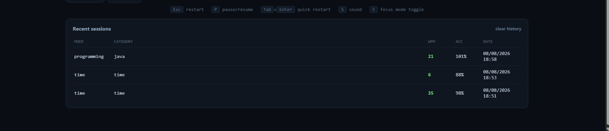

# Day 38 – Typing Speed Studio

## Interactive Productivity Applications

### Project: Typing Speed Studio

Typing Speed Studio is a premium interactive typing practice platform built as part of Day 38 of the #60DayClaudeChallenge.

The goal of this project was to create a typing application that goes beyond a basic typing test by providing multiple practice modes, real-time statistics, programming practice, performance analytics and session history.

---

## 🚀 Features

### Typing Modes

- Time Mode
- Word Count Mode
- Quote Mode
- Programming Mode
- Custom Text Mode
- Adaptive Mode
- Focus Mode
- Zen Mode

### Programming Practice

Programming Mode supports realistic typing practice using:

- HTML
- CSS
- JavaScript
- Python
- Java
- C++
- SQL

The programming passages include realistic syntax, indentation and programming symbols.

### 📊 Live Statistics

During a typing session, the application displays:

- WPM
- Raw WPM
- Accuracy
- Time
- Mistakes
- Current Streak
- Progress

### 📈 Analytics Dashboard

After completing a session, Typing Speed Studio provides:

- WPM
- Accuracy
- Consistency
- Percentile estimate
- WPM over time
- Accuracy over time
- Characters typed
- Correct characters
- Incorrect characters
- Missed characters
- Error heatmap
- Typing duration
- Best streak
- Achievement badges

### 🎨 User Experience

The application also includes:

- Dark editor-style interface
- Multiple themes
- Font-size controls
- Sound effects
- Pause and resume
- Restart functionality
- Focus Mode
- Zen Mode
- Keyboard shortcuts
- Responsive layout
- Smooth animations and transitions

### 💾 Session History

The application stores typing sessions locally so that previous attempts can be reviewed through the Recent Sessions section.

---

## 🛠️ Technologies Used

- HTML5
- CSS3
- Vanilla JavaScript
- LocalStorage
- Web Audio API

The application is implemented as a self-contained HTML file without external frameworks or libraries.

---

## 📸 Screenshots

### 1. Home Screen

The main interface provides access to typing modes, themes, sound controls, font-size controls and session history.

### 2. Typing Test

The typing interface provides a focused editor-style environment with a visible passage, cursor and real-time typing experience.

### 3. Live Statistics

The application tracks WPM, Raw WPM, accuracy, time, mistakes and typing streak in real time.

### 4. Programming Mode

Programming Mode provides realistic code snippets for typing practice, including Java and other programming languages.

### 5. Analytics Dashboard

The analytics dashboard displays WPM, accuracy, consistency, percentile, performance graphs, character statistics, error analysis and achievements.

### 6. Session History

Recent sessions can be reviewed with their mode, category, WPM, accuracy and date.

---

## 🧠 What I Learned

1. Learned how to build an interactive productivity application using HTML, CSS and Vanilla JavaScript.

2. Learned how real-time typing statistics such as WPM, Raw WPM and accuracy can be calculated and displayed.

3. Learned how different typing modes can provide different learning experiences.

4. Learned how programming-specific typing practice can be created using realistic code snippets.

5. Learned how performance data can be transformed into an analytics dashboard.

6. Learned how local storage can be used to maintain session history without requiring a backend or user account.

7. Learned how small UI features such as themes, keyboard shortcuts, sound feedback and focus modes can improve the overall user experience.

8. Improved my understanding of designing productivity applications with a polished and interactive interface.

---

## 💡 Key Insight

The most interesting part of this project was the analytics dashboard.

A typing application becomes more useful when it does not only show typing speed, but also helps users understand their accuracy, consistency, mistakes and progress.

This showed me that analytics can turn a simple practice activity into a more meaningful learning experience.

---

## 🤖 AI-Assisted Development

Claude was used as an AI development assistant during the project to help design and implement the interactive application.

The final application was tested locally in the browser through multiple typing modes and sessions.

---

## 📅 Challenge

Day 38 of the #60DayClaudeChallenge.

#60DayClaudeChallenge
