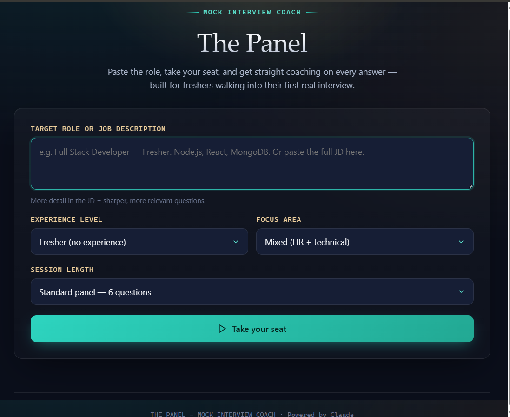
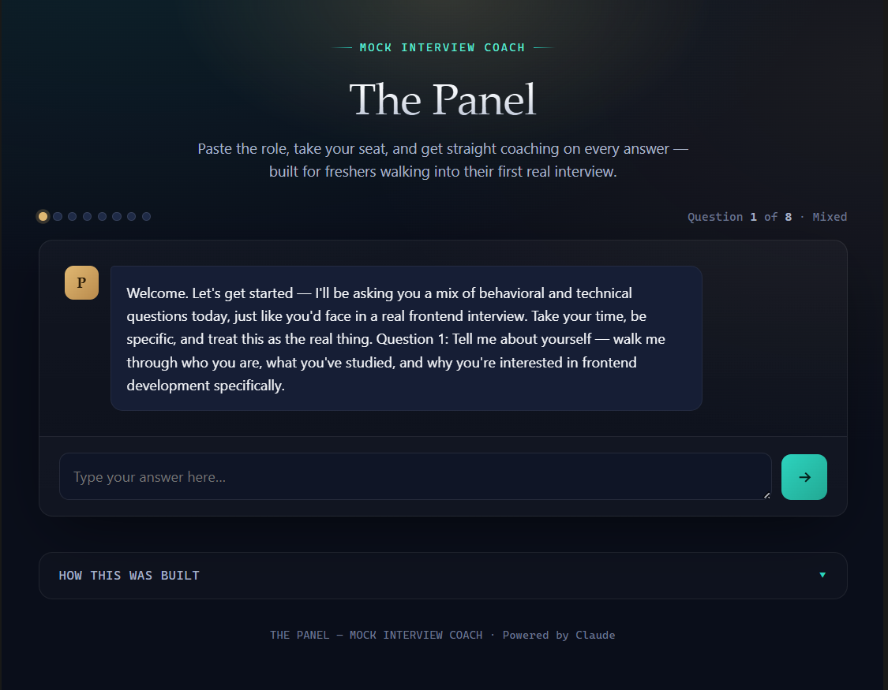
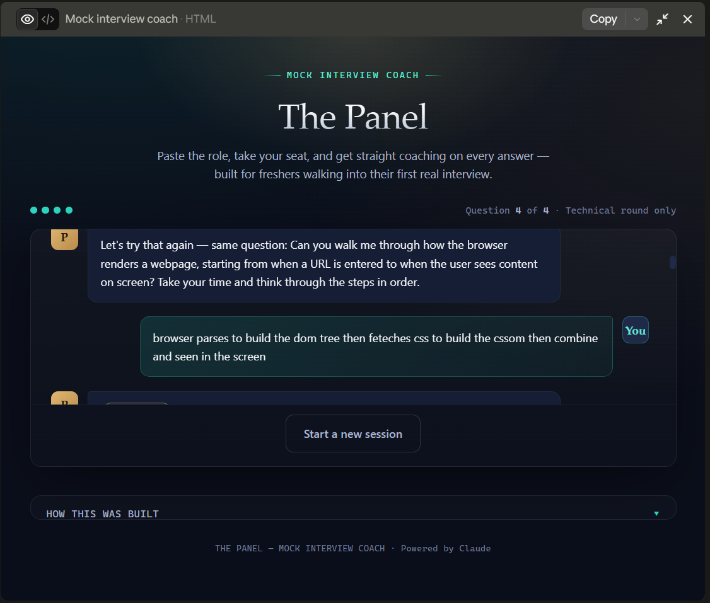

# Day 40 – Build Your Own AI Assistant 🤖

## AI Product Design – Mock Interview Coach

For Day 40 of the #60DayClaudeChallenge, I built **The Panel – Mock Interview Coach**, an AI-powered interview preparation assistant designed especially for freshers and early-career candidates.

The goal was to create an experience that feels more like a real interview panel than a generic chatbot.

---

## 🎯 Problem

Preparing for technical interviews can be difficult for freshers because they often don't know:

- What questions interviewers may ask
- Whether their answers are technically correct
- How to structure their responses
- How to improve weak answers
- How to practise realistic interview conversations

The Panel addresses this by simulating an interview and providing feedback after every answer.

---

## 💡 Solution

**The Panel** allows a candidate to configure a mock interview by providing:

- Target role or job description
- Experience level
- Interview focus area
- Number of questions

The AI then conducts the interview one question at a time and evaluates the candidate's answers.

---

## ✨ Features

### 🎯 Interview Setup

Users can select:

- Target role / Job Description
- Fresher / Final-year student
- Fresher with internships / projects
- Experience level
- Mixed HR + Technical
- Behavioral / HR
- Technical
- Resume & Project Deep Dive
- 4, 6 or 8 questions

---

### 🤖 AI Mock Interview

The assistant:

- Asks one question at a time
- Tailors questions to the target role
- Evaluates the candidate's response
- Provides specific feedback
- Suggests a stronger version of the answer
- Moves to the next question
- Provides a closing assessment

---

## 📊 Answer Evaluation

Every answer can receive one of four verdicts:

- Strong
- Solid
- Needs Work
- Weak

The feedback is designed to be specific to what the candidate actually answered instead of providing generic encouragement.

---

## 💡 "Try This Instead"

One of the features I found most useful was the **Try This Instead** section.

Instead of only telling the candidate that an answer needs improvement, the assistant provides a concrete example of how the answer could be improved.

This makes the feedback immediately actionable.

---

## 🧠 System Prompt Design

The AI assistant is designed as a professional interview coach named **The Panel**.

The system prompt defines:

- Role and personality
- Candidate context
- Interview objectives
- Question count
- Feedback structure
- Verdict categories
- Edge-case handling
- JSON response format

The model is instructed to keep feedback grounded in the candidate's actual answer and avoid inventing background information.

---

## 🔐 Edge Cases

The assistant handles:

- Empty answers
- One-word answers
- "I don't know" responses
- Off-topic input
- Abusive input
- Clarifying questions
- Final-question handling

For weak or incomplete answers, the assistant can re-ask the same question instead of incorrectly moving forward.

---

## 🎨 UI / UX Design

I intentionally avoided building a generic chatbot interface.

The application uses an interview-room inspired design:

- Dark premium interface
- Stage-light visual effect
- Gold and teal accents
- Interview progress indicators
- Coach and candidate avatars
- Verdict chips
- Feedback cards
- Animated typing indicator
- Responsive layout

The interface is designed to feel like sitting across from an interview panel.

---

## 🛠️ Technologies Used

- HTML5
- CSS3
- JavaScript
- Claude API
- Fetch API
- JSON
- Browser-based application

The application communicates with the Claude Messages API and maintains the interview conversation in the browser.

---

## 📸 Screenshots

### 1. Interview Setup

The candidate selects the target role, experience level, interview focus and session length.

---
### 2. Interview Dashboard

The application displays the interview progress and conversation interface.

---

### 3. Technical Interview Question

The assistant asks a technical interview question and allows the candidate to submit an answer.

---

### 4. AI Feedback

 .png)

The assistant evaluates the answer and identifies areas that need improvement.

---

### 5. Try This Instead

.png)

The assistant provides a concrete example of a stronger answer.

---

## 📚 What I Learned

### 1. AI Product Thinking

I learned that building an AI application is not just about connecting an API to a chatbot.

The user problem, workflow, feedback mechanism and interface all need to work together.

### 2. System Prompt Engineering

I learned how a detailed system prompt can control:

- AI personality
- Response structure
- Behaviour
- Edge cases
- Output consistency

### 3. AI-Powered Feedback

I learned how an AI assistant can evaluate user responses and provide actionable suggestions rather than simply generating text.

### 4. Structured AI Responses

Using a strict JSON response contract makes it easier for the frontend to interpret AI responses and render different UI components.

### 5. UX for AI Applications

The UI should match the purpose of the AI product.

For an interview coach, progress indicators, verdicts, feedback cards and interview-style visuals make more sense than a generic chat interface.

### 6. Handling Edge Cases

AI applications need to handle unexpected inputs gracefully, including empty responses, irrelevant content and clarifying questions.

---

## 🚀 Future Improvements

Possible future extensions include:

- Resume upload
- Company-specific interview preparation
- HR → Technical → Project interview flows
- Interview performance dashboard
- Persistent interview history
- Weak-topic tracking
- Interview score reports
- Database-backed user memory
- Web search for current company-specific interview questions

---

## 🎯 Key Takeaway

My biggest takeaway from Day 40 is that a good AI product combines:

**Problem → Prompt → AI → UX → Feedback**

The AI model is only one part of the product.

The overall experience is what makes the assistant useful.

---

## 🤖 Built with Claude

This project was created as part of the:

**#60DayClaudeChallenge**

Powered by Claude.

#60DayClaudeChallenge
#Anthropic
#ClaudeAI
#AIProductDesign
#AI
#WebDevelopment
#JavaScript
#FrontendDevelopment
#LearningInPublic
