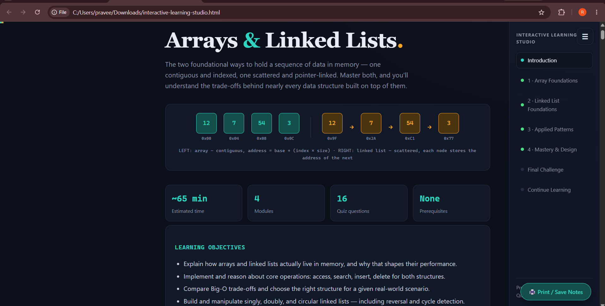
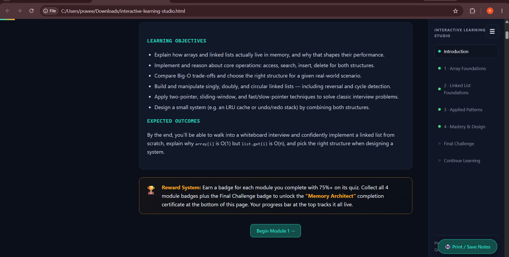
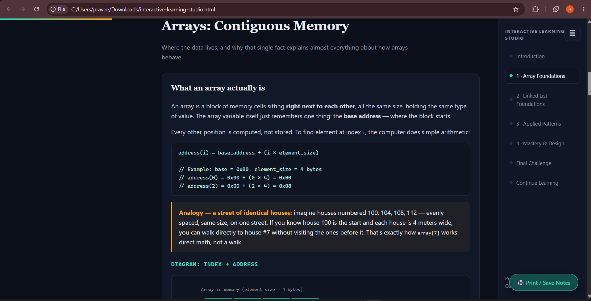

# Day 41 – Build Interactive Learning Studio 📚

## AI Education Systems – Interactive Learning Studio

For Day 41 of the #60DayClaudeChallenge, I built an **Interactive Learning Studio** using Claude.

The goal was to transform a technical topic into a complete, interactive learning experience instead of creating a simple static tutorial or learning roadmap.

---

## 🎯 Topic

### Arrays & Linked Lists

I selected **Arrays & Linked Lists** as the topic because they are fundamental data structures and are extremely important for coding interviews and DSA preparation.

The tutorial teaches how arrays and linked lists work internally, how they differ in memory, their time complexities, common patterns, and how to choose the right structure for different problems.

---

## 💡 What I Built

The final output is a self-contained HTML learning platform containing:

- Introduction
- Learning objectives
- Expected outcomes
- Estimated completion time
- Prerequisites
- Reward system
- 4 progressive learning modules
- Interactive examples
- Memory diagrams
- Practical exercises
- Array simulator
- Linked list simulator
- Common misconceptions
- Key takeaways
- Interactive quizzes
- Automatic quiz scoring
- Instant feedback
- Module completion tracking
- Progress tracking
- Final practical challenge
- Cheat sheet
- Summary notes
- Continue Learning resources
- Additional AI prompts

---

## 📚 Course Structure

### Module 1 – Array Foundations

This module explains how arrays are stored in contiguous memory and why array index access is O(1).

It covers:

- Array memory layout
- Base address
- Index-to-address calculation
- Static vs dynamic arrays
- Array insertion and deletion
- Dynamic array resizing
- Amortized complexity
- CPU cache behaviour

It also includes an interactive array simulator and a practical insertion exercise.

The module quiz evaluates understanding of array access, resizing, insertion complexity and cache performance. The course includes automatic scoring and unlocks the next module after achieving the required score. 

---

### Module 2 – Linked List Foundations

This module explains linked lists as scattered memory nodes connected using pointers.

It covers:

- Singly linked lists
- Doubly linked lists
- Circular linked lists
- Node structure
- Head pointer
- Insertion and deletion
- Pointer manipulation
- Linked list complexity
- Common misconceptions

The tutorial also includes a linked list simulator and practical exercises.

---

### Module 3 – Applied Patterns

The course moves from basic data structures to practical interview patterns.

It covers concepts such as:

- Two-pointer technique
- Sliding window
- Fast and slow pointers
- Linked list reversal
- Cycle detection
- Practical problem-solving

---

### Module 4 – Mastery & Design

The final module focuses on applying the concepts to real-world and system-design style problems.

It connects arrays and linked lists to larger data-structure design problems and helps learners understand when to choose one structure over another.

---

## 🧠 Interactive Learning Features

One of the main goals was to make the course interactive rather than just displaying text.

### Memory Visualization

The introduction visually compares:

**Array**

Contiguous memory:

12 | 7 | 54 | 3

with:

**Linked List**

12 → 7 → 54 → 3

This helps learners understand the fundamental memory difference between the two structures.

---

### 🧪 Practical Exercises

Learners are asked to reason through real operations.

For example:

Given:

[5, 8, 2, 9, 1]

the learner must determine what happens when inserting 7 at index 2.

The expected reasoning explains how elements shift and why the operation costs O(n).

---

### 🧩 Interactive Quizzes

Each module contains a 4-question quiz.

The quiz provides:

- Multiple-choice questions
- Answer selection
- Automatic scoring
- Correct/incorrect feedback
- Explanations
- Performance summary
- Module badge
- Next-module unlocking

The course contains **16 quiz questions in total**.

---

## 🏆 Reward System

The application includes a gamified reward system.

Learners can earn a badge for each module by achieving the required quiz score.

After completing all modules and the final challenge, the learner can unlock the final completion achievement.

This makes progress visible and encourages learners to complete the entire tutorial.

---

## 📊 Cheat Sheet

The final section contains a quick reference for:

### Arrays

- Access – O(1)
- Search – O(n)
- Insert/delete at end – O(1) amortized
- Insert/delete at start/middle – O(n)

### Linked Lists

- Access – O(n)
- Search – O(n)
- Insert/delete at head – O(1)
- Insert/delete at known node – O(1)

It also summarizes important patterns such as:

- Two pointers
- Sliding window
- Fast/slow pointers
- Reversal
- Cycle detection

---

## 🎨 UI / UX

I designed the application as a learning platform rather than a generic webpage.

The interface includes:

- Premium dark theme
- Responsive layout
- Fixed navigation rail
- Progress bar
- Module navigation
- Animated interactions
- Interactive cards
- Diagrams
- Quiz components
- Completion tracking
- Print / Save Notes option

The generated application uses only:

- HTML
- CSS
- JavaScript

No external libraries or frameworks are required.

---

## 🛠️ Technologies Used

- HTML5
- CSS3
- JavaScript
- SVG
- DOM Manipulation
- Browser Local State / JavaScript State
- Responsive Web Design

---

## 🧠 What I Learned

### 1. Instructional Design

I learned that teaching a technical concept effectively requires more than presenting definitions.

A good learning experience should progress from:

**Concept → Example → Analogy → Visualization → Practice → Quiz → Application**

---

### 2. Interactive Learning

Interactive elements can make technical concepts easier to understand.

For data structures, visualizing memory layouts and pointer relationships is much more effective than explaining everything using paragraphs alone.

---

### 3. Progressive Difficulty

The four-module structure helped organize the learning experience from:

**Foundations → Understanding → Application → Mastery**

This prevents learners from being introduced to advanced concepts before understanding the fundamentals.

---

### 4. Educational UX

I learned how learning platforms can use:

- Progress indicators
- Badges
- Quiz scores
- Module unlocking
- Feedback
- Navigation
- Completion tracking

to make the learning process more engaging.

---

### 5. AI Course Generation

Claude can be used not only for generating answers but also for designing complete educational experiences containing:

- Curriculum
- Explanations
- Examples
- Exercises
- Quizzes
- Diagrams
- Challenges
- Resources

---

### 6. Combining Content and Interaction

The biggest learning from this task was understanding that an AI-generated educational product becomes much more useful when the generated content is combined with interactive frontend behaviour.

---

## 🚀 Future Improvements

I would like to extend this project by adding:

- User accounts
- Persistent learning progress
- More DSA topics
- Code execution inside exercises
- Difficulty selection
- Personalized quizzes
- AI-powered explanations
- AI-generated questions based on weak areas
- Progress analytics
- Certificates
- Spaced-repetition revision
- More interactive visualizations

---

## 🎯 Key Takeaway

Day 41 taught me that AI can be used to build complete learning experiences, not just generate educational text.

A strong AI education product combines:

**Curriculum + Content + Interaction + Assessment + Progress Tracking**

The final result is an interactive learning environment where users can learn, practise, test their knowledge and track their progress.

---

## 📸 Project Screenshots

### 1. Interactive Learning Studio – Course Overview

The main dashboard introduces the Arrays & Linked Lists course, showing the memory visualization, estimated learning time, number of modules, quiz count and prerequisites.

### 2. Learning Objectives & Reward System

The introduction defines the learning objectives, expected outcomes and gamified reward system.

### 3. Interactive Array Foundations Module

This module explains contiguous memory, address calculation, practical analogies and visual diagrams.

### 4. Interactive Quiz & Module Unlock

The quiz provides automatic scoring, answer explanations and unlocks the next module after successful completion.

## 🤖 Built as Part of the 60-Day Claude Challenge

Day 41 of the:

#60DayClaudeChallenge

#Anthropic
#ClaudeAI
#AIEducation
#AIProductDesign
#InteractiveLearning
#WebDevelopment
#JavaScript
#HTML
#CSS
#DSA
#DataStructures
#LearningInPublic
