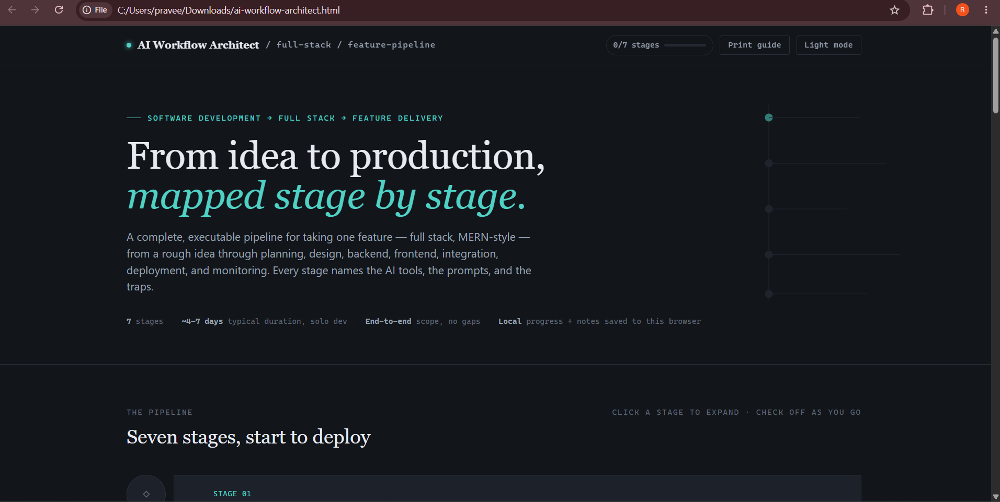
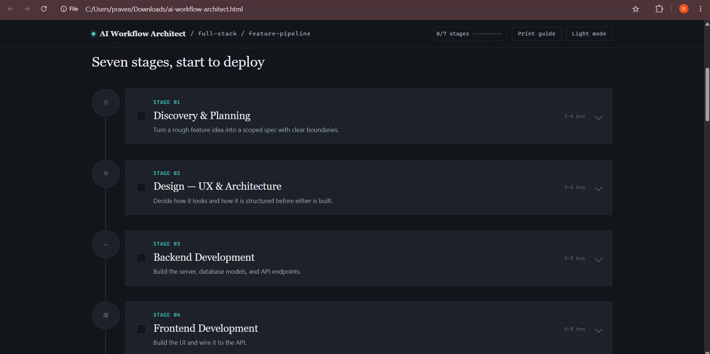
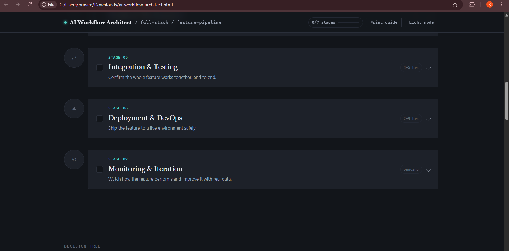
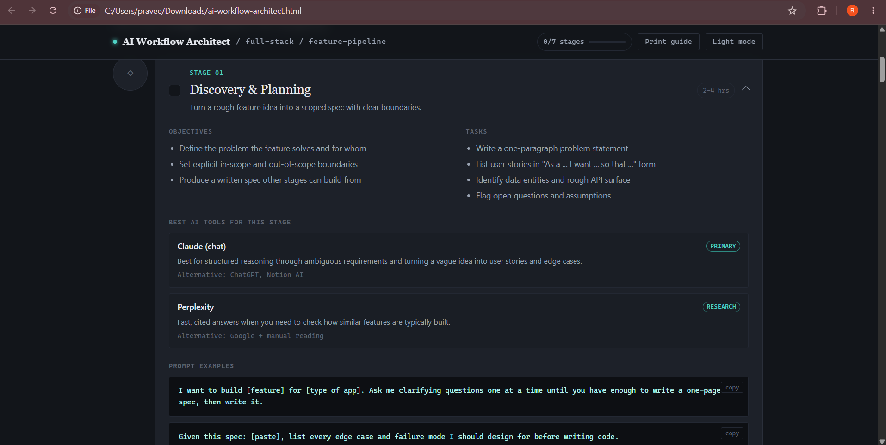
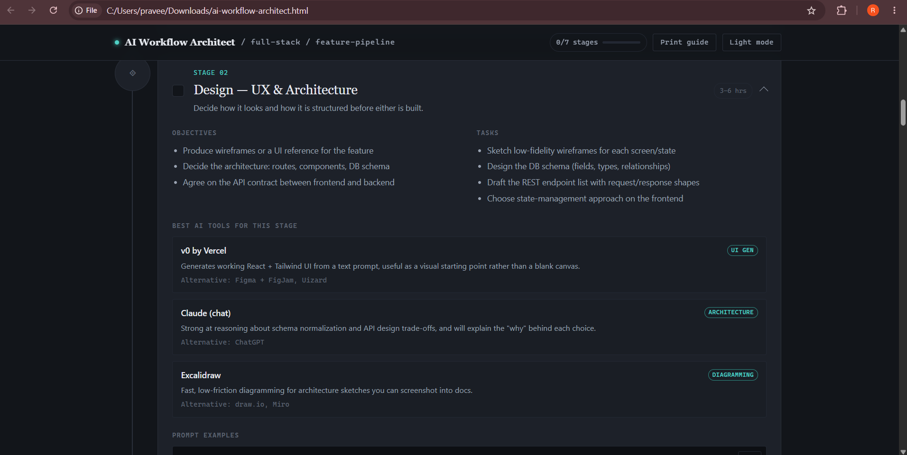
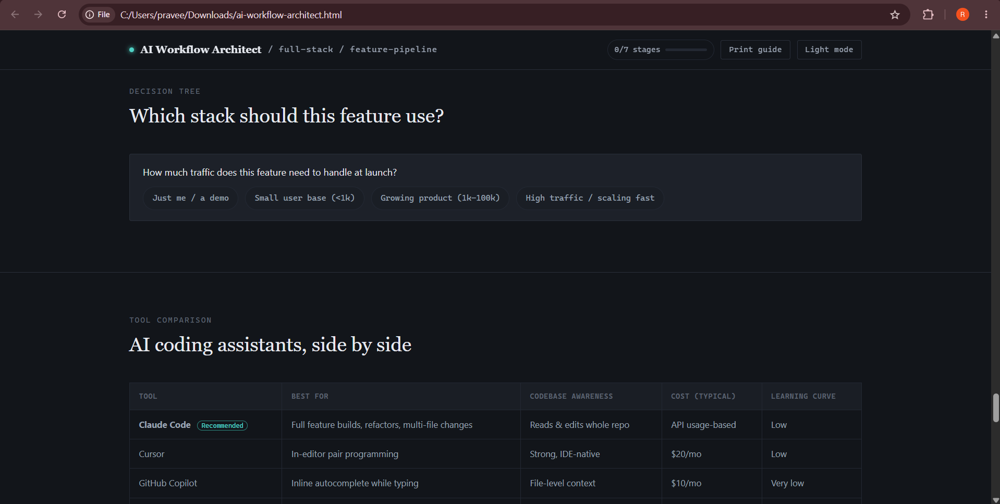

# Day 43 – AI Workflow Architect

## 🚀 Project Overview

For Day 43 of the 60-Day Claude Challenge, I built an **AI Workflow Architect** — an interactive workflow platform designed to map a complete full-stack feature from a rough idea to production.

The application focuses on **Software Development → Full Stack → Feature Delivery**.

It provides a structured 7-stage workflow covering planning, design, development, testing, deployment, and monitoring.

## 🎯 Workflow Stages

### Stage 01 – Discovery & Planning

- Define the problem and target users
- Set in-scope and out-of-scope boundaries
- Create user stories
- Identify data entities and API requirements
- Identify edge cases and assumptions

### Stage 02 – Design — UX & Architecture

- Create wireframes/UI references
- Design the database schema
- Define REST API contracts
- Decide frontend state management
- Plan loading, error and empty states

### Stage 03 – Backend Development

- Implement database models
- Build API routes and controllers
- Add input validation and error handling
- Add authentication/authorization where required
- Test APIs using Postman or similar tools

### Stage 04 – Frontend Development

- Build reusable UI components
- Connect the frontend with APIs
- Add form validation
- Handle loading, error and empty states
- Build responsive layouts

### Stage 05 – Integration & Testing

- Test frontend and backend together
- Test user stories end-to-end
- Write unit and integration tests
- Identify and fix bugs
- Test unhappy paths and edge cases

### Stage 06 – Deployment & DevOps

- Configure deployment
- Set environment variables securely
- Deploy frontend and backend
- Perform production smoke testing
- Maintain a rollback plan

### Stage 07 – Monitoring & Iteration

- Monitor production errors
- Track important usage events
- Review logs
- Collect feedback
- Prioritize future improvements

## 🤖 AI Tools Included

The workflow recommends different AI tools depending on the development stage:

- **Claude** – Planning, requirements and architecture reasoning
- **Claude Code** – Repository-aware coding, refactoring and DevOps assistance
- **v0 by Vercel** – Initial React UI generation
- **GitHub Copilot** – Inline code autocomplete
- **Postman** – API testing
- **Sentry** – Production error monitoring
- **Perplexity** – Research and cited information
- **Excalidraw** – Architecture and workflow diagrams

## 🧠 Interactive Features

The application includes:

- 7-stage interactive pipeline
- Stage completion tracking
- Progress indicator
- Expandable workflow stages
- Personal notes for every stage
- Bookmark functionality
- Copyable prompt examples
- AI tool comparison table
- Interactive stack decision tree
- Recommended AI stack
- Learning resources
- Developer communities
- Search keywords
- Future automation opportunities
- Dark/Light mode
- Printable workflow guide
- LocalStorage for saving progress, notes and bookmarks

## 💡 Key Learnings

### 1. Workflow Design

I learned how to design an entire development workflow instead of treating planning, coding, testing and deployment as isolated activities.

### 2. AI Tool Selection

Different stages benefit from different AI tools. The right tool depends on the task — for example, planning requires reasoning, while coding may require repository-aware assistance.

### 3. Automation Thinking

The project helped me identify repetitive development activities that can potentially be automated.

Examples include:

- Automatically generating pull request descriptions and changelogs
- AI-generated test suites
- Automated accessibility and performance audits
- Automatically updating API documentation
- AI-assisted bug triage

### 4. Human-in-the-Loop Development

AI can accelerate development, but important decisions should remain with the developer.

The workflow specifically keeps humans involved in:

- Feature scope decisions
- Reviewing AI-generated code
- Security-sensitive code
- Production deployment decisions

## 📈 Productivity Insight

The biggest productivity insight from this challenge was that **structured workflows reduce the uncertainty of where to start and what to do next**.

Instead of jumping directly into coding, the process creates a clear path:

**Idea → Planning → Design → Backend → Frontend → Testing → Deployment → Monitoring**

AI can then assist at each stage while the developer remains responsible for the technical and product decisions.

## 🛠️ Technologies Used

- HTML
- CSS
- JavaScript
- LocalStorage
- Responsive Web Design
- Interactive UI components

The application was created as a **single self-contained HTML file without external libraries or frameworks**.

---

# 📸 Application Screenshots

## 1. AI Workflow Architect Dashboard

The main dashboard presents the complete workflow, project scope, progress tracking and seven-stage development pipeline.



---

## 2. Seven Workflow Stages – Part 1

Stages 01–04 cover Discovery & Planning, Design & Architecture, Backend Development and Frontend Development.



---

## 3. Seven Workflow Stages – Part 2

Stages 05–07 cover Integration & Testing, Deployment & DevOps, and Monitoring & Iteration.



---

## 4. Stage 01 – Discovery & Planning

This section demonstrates the detailed objectives, tasks, recommended AI tools, alternatives and prompt examples for the planning stage.



---

## 5. Stage 02 – Design & Architecture

This section demonstrates UX planning, database schema design, API contracts, state management and architecture-related AI tools.



---

## 6. Interactive Decision Tree & AI Tool Comparison

The application includes an interactive decision tree for choosing a suitable technology stack along with an AI coding assistant comparison.



---

## 7. Resources & Next Steps

The conclusion section provides learning resources, developer communities, search keywords and future AI automation opportunities.


---

## 📂 Project Files

```text
Day43/
├── day43.md
├── ai-workflow-architect.html
└── screenshots/
    ├── AiWorkflow-dashboard.png
    ├── SevenStages01.png
    ├── SevenStages02.png
    ├── Stage01.png
    ├── Stage02.png
    ├── Decision-tree.png
    └── Conclusion.png
