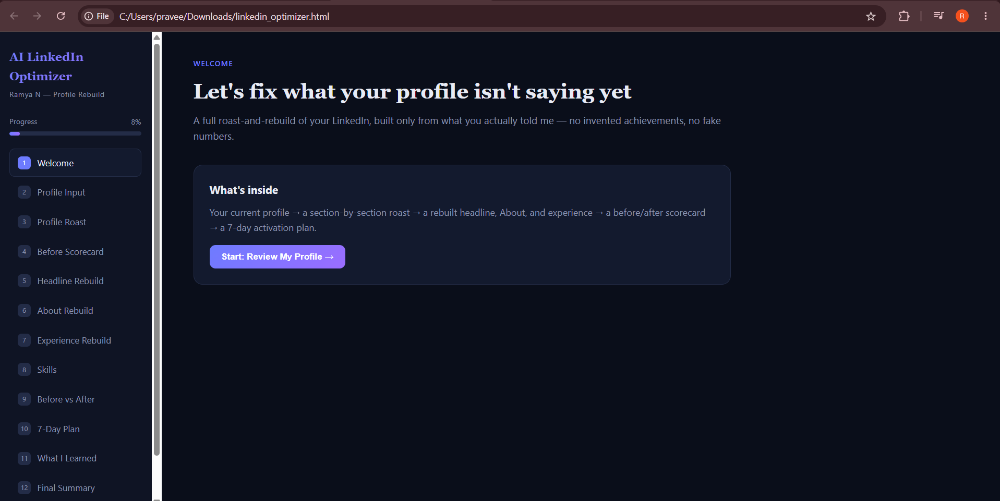
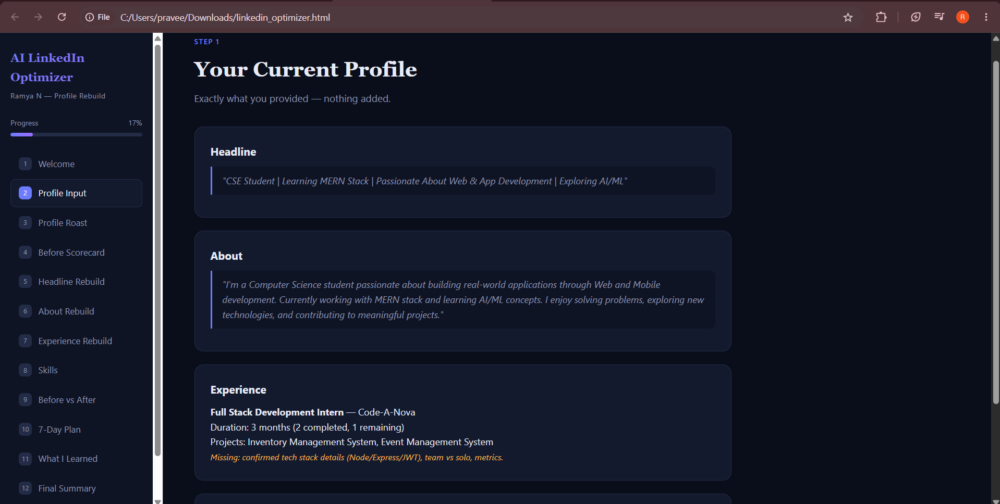
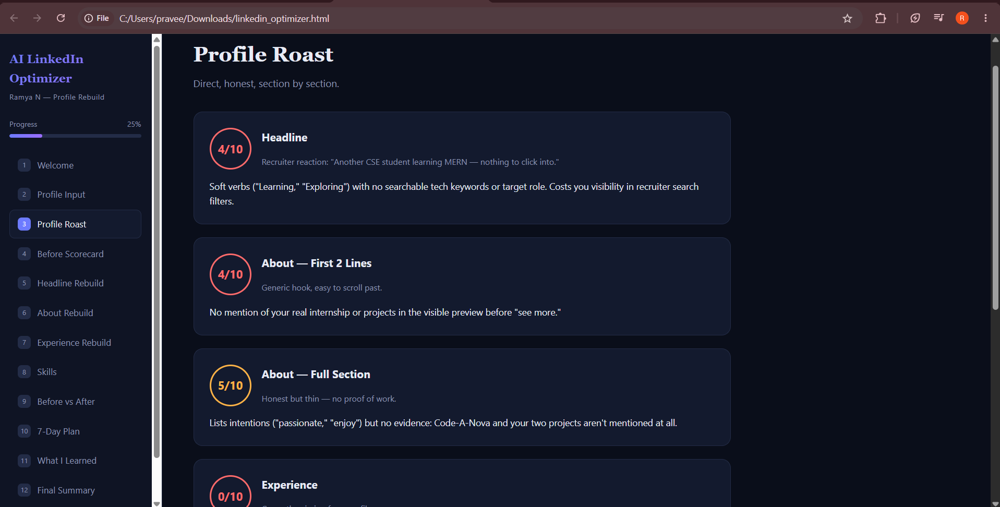
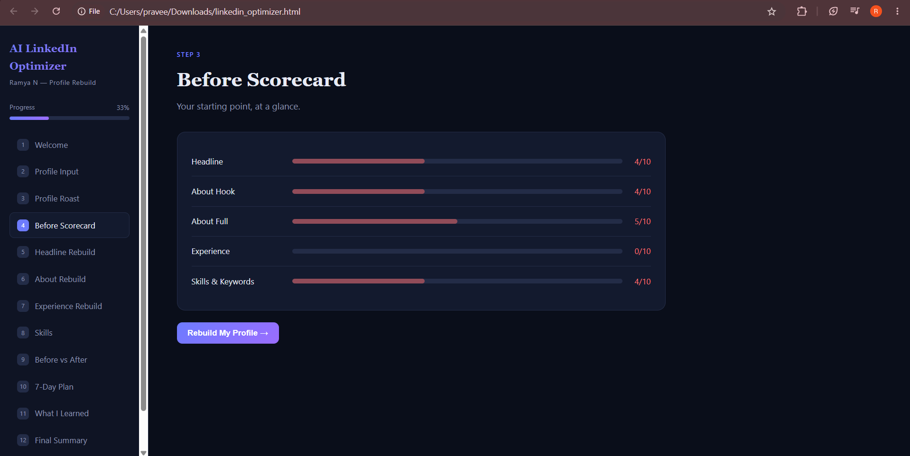
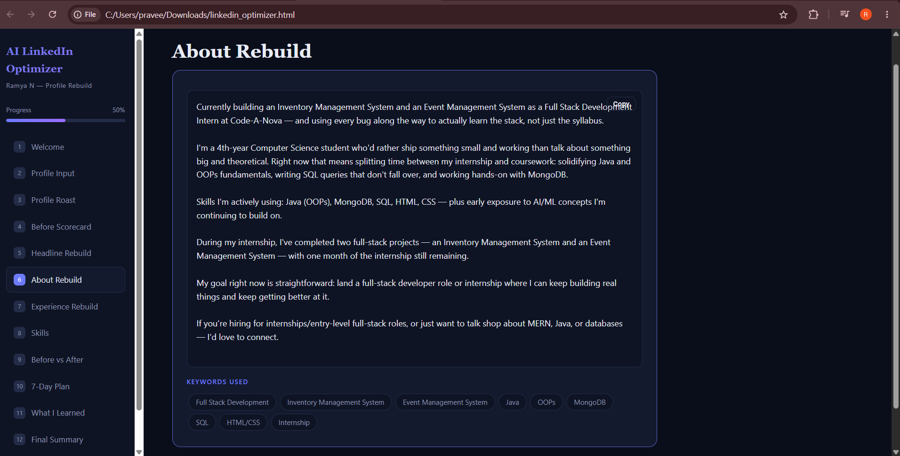
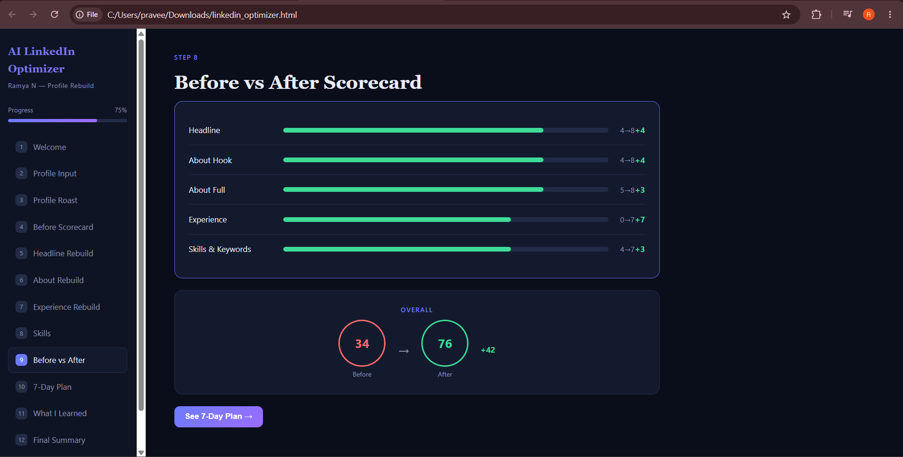
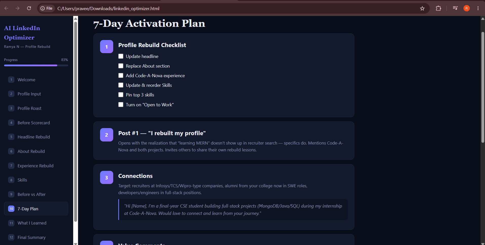
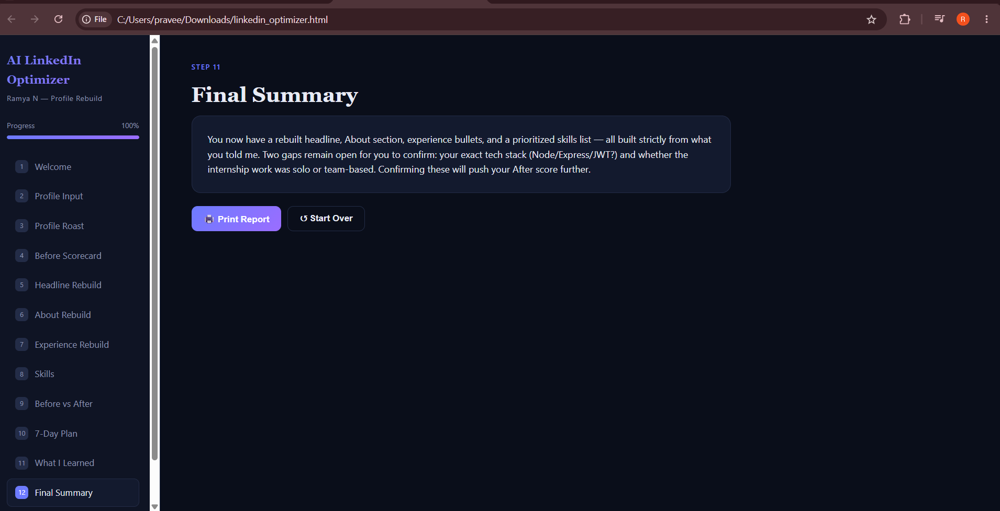

Day 44 — Build an AI-Powered LinkedIn Profile Optimizer

🚀 Project Overview

For Day 44 of the 60-Day Claude Challenge, I built an AI-powered LinkedIn Profile Optimizer.

The application follows a Roast → Rebuild → Activate workflow to help users improve their LinkedIn profile from a recruiter and personal-branding perspective.

It analyzes the current profile, scores key sections, suggests improved content, compares the profile before and after optimization, and provides a 7-day activation plan.

Privacy note: The screenshots are project/demo screenshots. Personal LinkedIn information does not need to be shared publicly.

🛠️ Tech Used

Claude — AI-assisted application generation and optimization workflow

HTML — Application structure

CSS — Styling and responsive interface

JavaScript — Navigation, progress tracking, copy buttons, theme toggle, checklists and scorecards

GitHub — Version control and submission

✨ Key Features

1. Profile Input

The application captures:

Current headline

About section

Experience

Skills

It follows the rule of using only the information provided and avoiding fabricated achievements or metrics.

2. Profile Roast

The application evaluates:

Headline

About — First 2 Lines

About — Full Section

Experience

Skills & Keywords

Each section receives a score and a direct recruiter-style explanation.

The example profile received a starting score of 34/100.

3. Headline Rebuild

Three approaches are generated:

Keyword Optimized — recruiter search visibility

Value Proposition — highlights real project output

Personal Brand — networking and positioning

4. About Section Rebuild

The rebuilt About section includes:

A stronger opening hook

Current work and learning

Relevant skills

Project proof

Career direction

Call to connect

5. Experience Rebuild

The example highlights the user's Full Stack Development Internship at Code-A-Nova, including:

Inventory Management System

Event Management System

Java/OOPs

MongoDB

SQL

The application also identifies missing information such as confirmed technologies, team size, and measurable results.

6. Skills Recommendations

The application prioritizes skills such as:

Java

SQL

MongoDB

Object-Oriented Programming

HTML

CSS

Full Stack Development

Problem Solving

Git/GitHub

REST APIs

It also recommends the top three skills to pin.

7. Before vs After Scorecard

Section

Before

After

Headline

4/10

8/10

About Hook

4/10

8/10

About Full

5/10

8/10

Experience

0/10

7/10

Skills & Keywords

4/10

7/10

Overall

34/100

76/100

Overall improvement: +42 points

These scores are the application's example assessment based on the information entered into the demo.

8. 7-Day LinkedIn Activation Plan

The application provides a practical plan covering:

Profile updates

Publishing content

Strategic connections

Value-based comments

Engagement

Performance review

9. Interactive Features

Sidebar navigation

Progress indicator

Light/dark theme toggle

Copy-to-clipboard buttons

Interactive checklist

Before/after score visualization

Print report

Start-over option

Responsive layout

📚 What I Learned

1. Personal branding is about clarity

A LinkedIn profile should quickly communicate:

Who I am → What I can do → What I have built → What opportunity I am looking for.

2. Specifics are stronger than generic statements

Words such as learning, passionate, and exploring describe intent, but real projects and technologies provide stronger evidence.

3. Keywords matter

Relevant technical keywords should be used naturally so recruiters can understand the candidate's skills and improve search visibility.

4. Experience should show proof of work

Experience is stronger when it highlights projects, technologies, contributions, and measurable outcomes whenever those details are available.

5. AI can become an interactive career tool

Claude can be used not only for text generation, but also to build a complete interactive HTML application around a structured workflow.

6. Never fabricate achievements

If a metric, technology, team size, or achievement is unknown, it should be marked as missing rather than invented.

💡 Biggest Takeaway

Proof beats passion.

A profile becomes stronger when it clearly shows real work, relevant technologies, projects, and the direction the candidate wants to grow in.

## 📸 Screenshots

### 1. AI LinkedIn Optimizer Dashboard

### 2. Current Profile Input

### 3. Profile Roast

### 4. Before Scorecard

### 5. About Rebuild

### 6. Before vs After Scorecard

### 7. 7-Day Activation Plan

### 8. Final Summary

📁 Project Files

linkedin_optimizer.html — Complete interactive HTML application

screenshots/ — Screenshots demonstrating the application workflow

🎯 Day 44 Outcome

Built and tested an interactive AI LinkedIn Profile Optimizer combining profile analysis, scoring, rewriting, keyword recommendations, and a 7-day activation strategy into one application.

Day 44 completed. 🚀

#60DayClaudeChallenge #ClaudeAI #AICareerTools #LinkedIn #PersonalBranding #CareerGrowth #HTML #CSS #JavaScript #LearningInPublic
