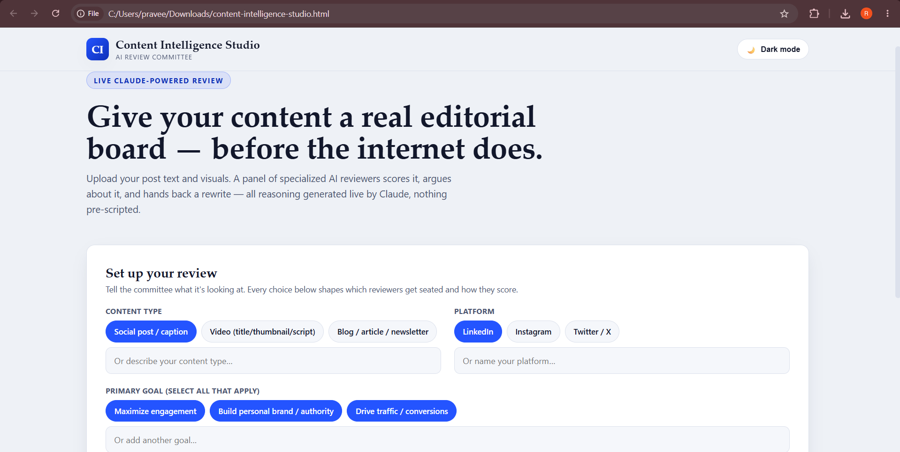
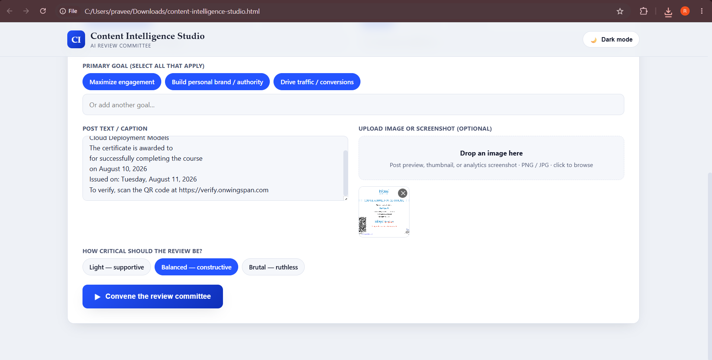
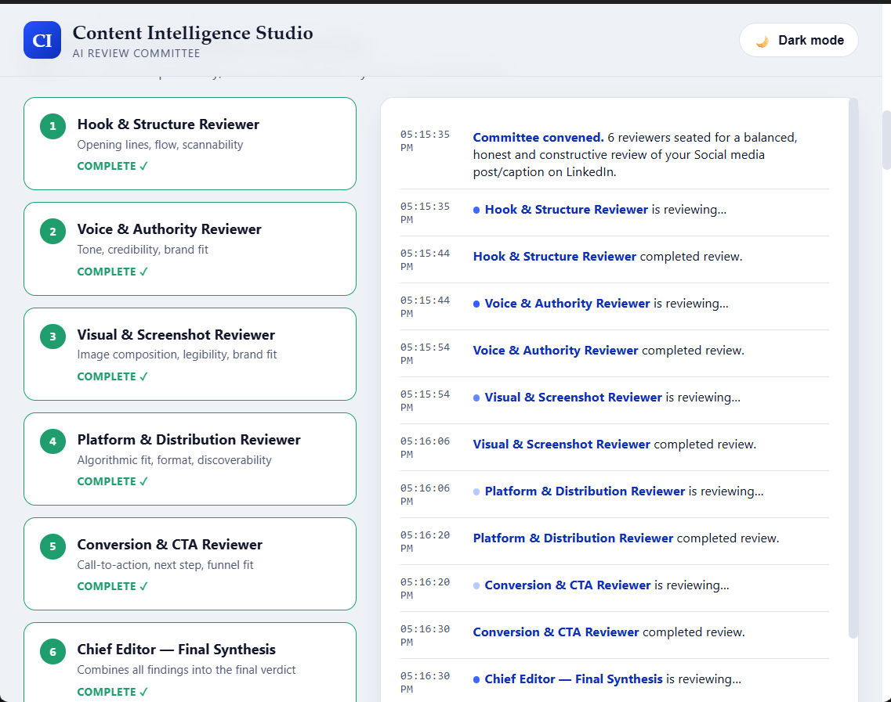
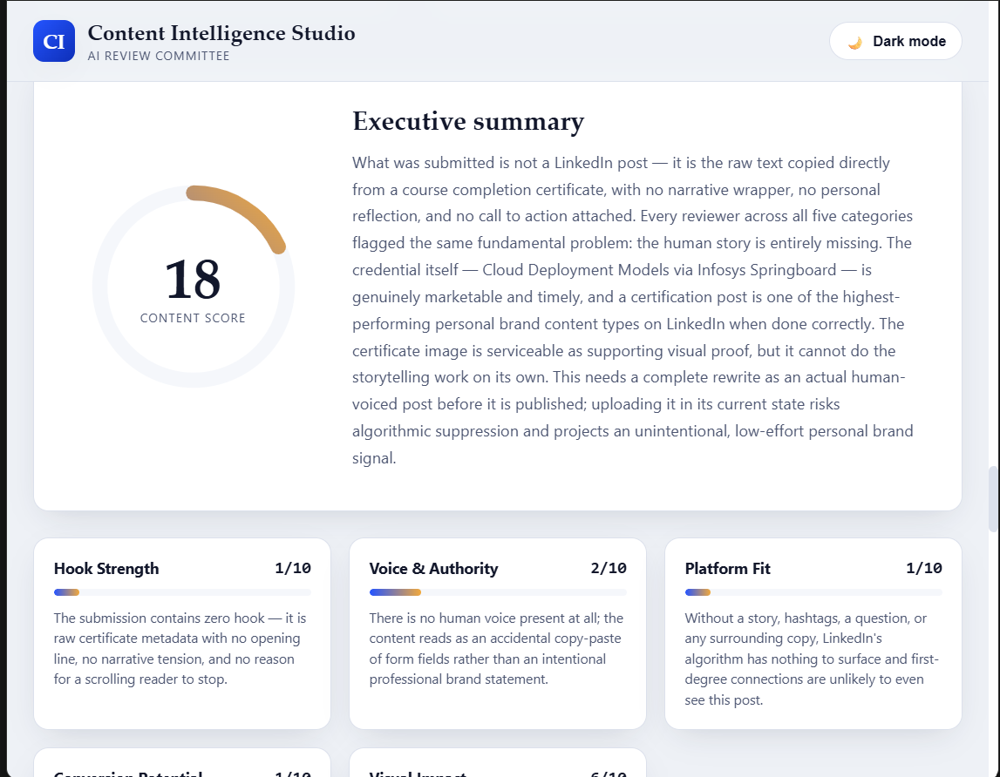
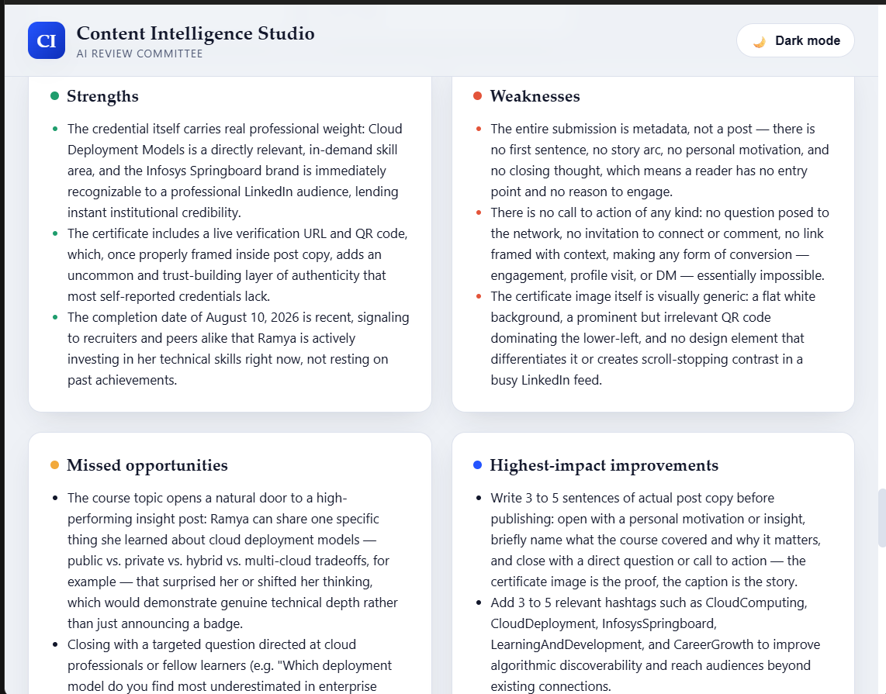
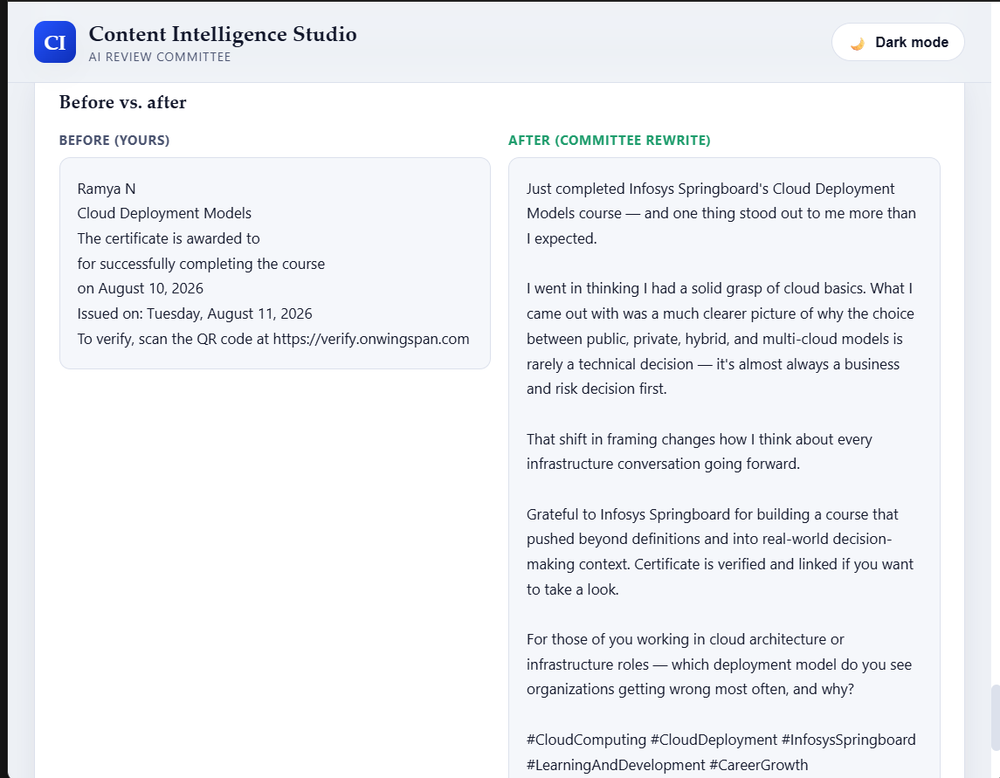

# Day 47 — Content Intelligence Studio

## What I built

An AI-powered content review committee — a single self-contained HTML app that acts as a live editorial board for your posts, before you publish them.

Instead of generic content-tips, this convenes a panel of specialized AI reviewers who each independently score your content, then a Chief Editor synthesizes everything into one final report — all reasoning generated live via the Claude API. No hardcoded logic, no canned feedback, no templated scores.

## How it works

1. You set up the review — content type, platform, goals, strictness level — then paste your text and/or drop in an image.
2. The committee convenes. Reviewers are seated dynamically based on what you submit (an image adds a dedicated Visual Reviewer that analyzes it directly via Claude's vision).
3. Each reviewer works the content independently, streaming live notes into an activity log.
4. A Chief Editor synthesizes everything into a final report: overall score, category breakdowns, strengths/weaknesses, missed opportunities, a full rewrite, alternative hooks, a publishing checklist, and a predicted-performance estimate (clearly flagged as an AI estimate, not a guarantee).

## Reviewers

- Hook & Structure — opening lines, flow, scannability
- Voice & Authority — tone, credibility, brand fit
- Visual & Screenshot (conditional) — composition, legibility, brand fit
- Platform & Distribution — algorithmic fit, discoverability
- Conversion & CTA — call-to-action clarity, funnel fit
- Chief Editor — final synthesis

## The interesting problem I had to solve

Structured AI output usually means asking for JSON — and JSON parsing breaks constantly on real model output (stray text, escaped characters, truncation). Instead I designed a lightweight plain-text protocol using `@@TAG` markers, and wrote a custom parser for it. Zero JSON, zero parsing errors, fully structured data reaching the UI.

##Screenshots 

## Tech

Vanilla HTML/CSS/JS · Claude Messages API (`claude-sonnet-4-6`) · no external libraries · single-file, no build step · dark mode · retry logic on failed calls · fully responsive.

#60DayClaudeChallenge #BuildInPublic #GenAI #ClaudeAPI #ContentStrategy
