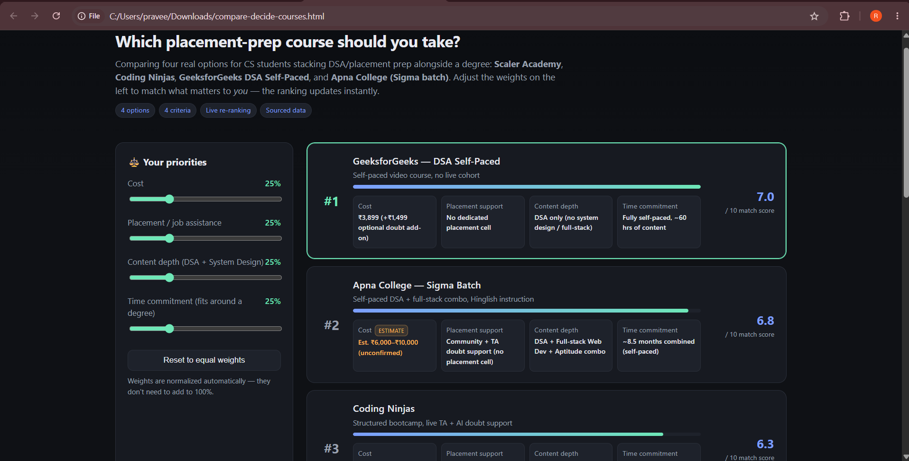
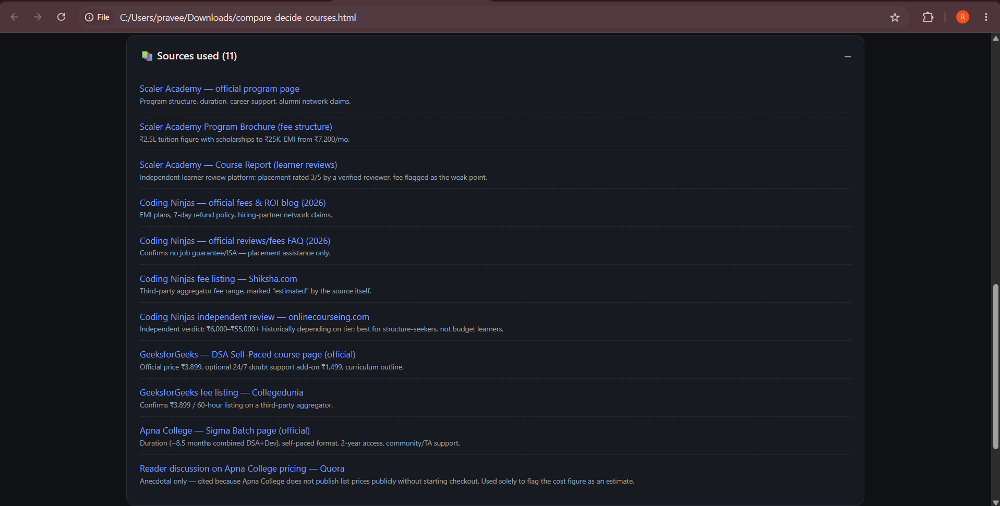

Readme · MD
Day 48 — Compare & Decide: Placement Prep Course Chooser

Part of the ABTalks 60-Day Claude Challenge 🚀

A single-file, AI-researched decision tool that helps CS students pick a DSA/placement-prep course by comparing Scaler Academy, Coding Ninjas, GeeksforGeeks DSA Self-Paced, and Apna College (Sigma Batch) across cost, placement support, content depth, and time commitment — with a live, weight-adjustable ranking.

🎯 The Problem

Every student prepping for placements hits the same wall: too many course options, no clean side-by-side comparison, and marketing pages that don't tell you what you actually need to know. I wanted a tool that lets me decide what matters most (cost? placement help? depth?) and get an honest, sourced answer — not another sales page.

🧠 How It Was Built

This was built as a structured research + build pipeline, not a one-shot prompt:

Interview phase — Claude asked me one MCQ at a time: what category, who it's for, which criteria matter, where data should come from, and whether weighting should be adjustable. No app was generated until this was locked in.
Research phase — Claude ran live web searches against official course pages (Scaler, Coding Ninjas, GeeksforGeeks, Apna College) plus independent review sites, and only used numbers it could cite.
Build phase — A single self-contained HTML/CSS/JS file (no frameworks, no external libraries) with a live scoring engine.
✨ Features
Live weight sliders — drag cost/placement/depth/time-commitment weights and the ranking re-sorts instantly, client-side.
Sources panel — every data point traces back to a named, linked source (11 citations across official pages + independent reviews).
"How this was researched" panel — shows exactly where numbers came from, and calls out real conflicts between sources (e.g. Scaler's brochure price vs. what learners actually report paying).
Estimate flags — Apna College doesn't publish public pricing, so its cost figure is explicitly marked as an unconfirmed estimate, not presented as fact.
Responsive, dark-themed UI — clean card layout, no external CSS/JS dependencies.
Graceful edge-case handling — zero-weight state, loading state, and render-failure fallback are all handled.
📸 Screenshots

Live ranking with adjustable weight sliders Ranking re-sorts instantly as weights change — each card shows the sourced facts behind its score, with estimates clearly flagged.

Sources panel Every fact in the tool traces back to a named, clickable source — official pages first, independent reviews for cross-checking.

🛠️ Tech Stack
Pure HTML/CSS/JavaScript — single file, zero dependencies
No frameworks, no build step — open it directly in a browser
⚠️ Honesty Note

This is a decision-support tool, not financial or admissions advice. The 1–10 "match scores" are Claude's own normalization of sourced facts, not numbers pulled from any source — they're shown alongside the raw facts so you can disagree with the weighting and re-score it your own way. Prices and placement claims shift often; always verify on the official page before paying.

🔗 Try It

Open compare-decide-courses.html in any browser — no setup needed.

📅 Day 48 of 60 — ABTalks Claude Challenge 🔗 Connect: LinkedIn · GitHub
