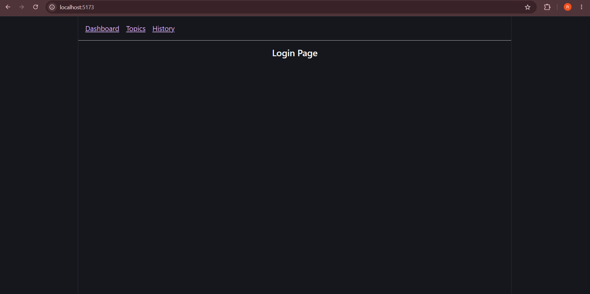
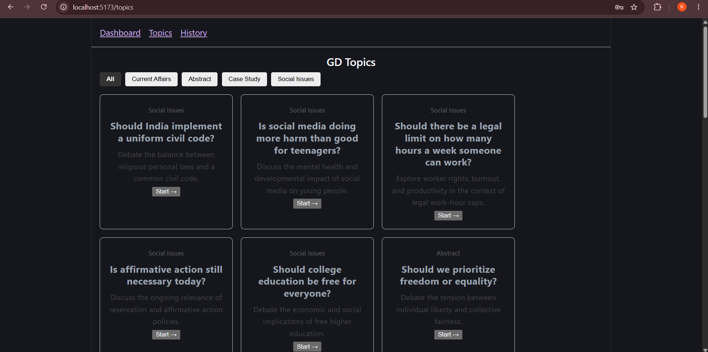
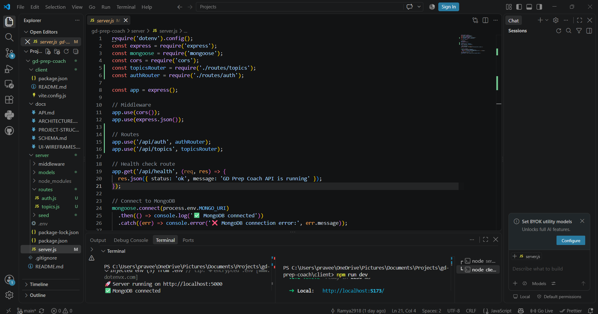

# Day 54 — Core Feature Implementation

## 🚀 Day 4 of 10 — One Verified Milestone at a Time

Today I continued my capstone project from Day 53 and worked on the **Core Feature Implementation** milestone according to the 10-Day Blueprint.

The goal was to implement today's assigned functionality step by step, test each milestone, debug issues when required, and verify the application before moving forward.

---

## 🛠️ Today's Work

During Day 54, I:

- Continued the existing capstone project from Day 53.
- Followed the Day 4 section of the 10-Day Blueprint.
- Implemented the assigned core functionality.
- Ran the frontend application locally.
- Ran the backend server locally.
- Verified the MongoDB connection.
- Tested the Signup flow.
- Tested the Login flow.
- Tested the GD Topics section.
- Tested the available topic categories.
- Verified the application through browser testing.
- Checked that the implemented features were working correctly.

---

## 💻 Application

### Frontend

The frontend application was successfully running locally at:

```text
http://localhost:5173/
````

### Backend

The backend server was running locally on:

```text
http://localhost:5000
```

### Database

MongoDB was successfully connected to the backend.

---

## ✅ Features Tested

### 1. Signup

The Signup page was opened and tested successfully.

### 2. Login

The Login page was opened and tested successfully.

### 3. GD Topics

The GD Topics section was opened successfully.

The available topic categories were also checked, including:

* All
* Current Affairs
* Abstract
* Case Study
* Social Issues

### 4. Application Flow

The application was tested through the browser to verify that the implemented pages and functionality were loading correctly.

---

## 🧪 Verification

The application was tested locally after implementation.

### Verification checklist

* [x] Frontend starts successfully
* [x] Backend starts successfully
* [x] MongoDB connection verified
* [x] Signup page tested
* [x] Login page tested
* [x] GD Topics page tested
* [x] Topic categories tested
* [x] Application loads correctly in browser
* [x] Core functionality tested

---

## 📸 Screenshots

### Signup Page


### Login Page



### GD Topics



### Application Test




---

## 📚 Key Learnings

### 1. Blueprint as a Boundary

I learned how following a daily Blueprint helps keep development focused on the features planned for the current milestone instead of adding unnecessary functionality.

### 2. Milestone-Based Development

Breaking implementation into smaller milestones makes it easier to build, test and verify each feature before continuing.

### 3. Complete Testing

I learned that simply running an application is not enough. Each important feature should be tested through the actual user flow.

### 4. Frontend and Backend Integration

I gained more understanding of how the frontend application communicates with the backend server running locally.

### 5. Database Integration

I verified the MongoDB connection and understood the importance of confirming the database connection before relying on backend functionality.

### 6. Debugging Before Continuing

A useful lesson from today's workflow was to identify and resolve problems before continuing to build additional features.

---

## 💡 Today's Main Takeaway

> **Build one milestone, test it completely, fix problems, and then move to the next milestone.**

Milestone-based development makes a multi-day project easier to manage and reduces the risk of building new functionality on top of broken code.

---

## 🎯 Day 54 Outcome

The Day 4 implementation was completed and the application was tested locally.

The frontend was successfully running at:

```text
http://localhost:5173/
```

The backend was running at:

```text
http://localhost:5000
```

MongoDB connectivity was also verified.

The implemented application flow was tested through the browser.

---

## 📁 Project Structure

```text
Day54/
│
├── day54.md
│
└── screenshots/
    ├── SignUp.png
    ├── Login.png
    ├── current-affairs.png
    ├── Test-case.png
    └── backend-mongodb.png
```

---

## 🚀 Next Step

Continue with **Day 5 of the 10-Day Blueprint** and implement the next scheduled milestone without changing or redesigning the planned scope.

---

## 🏆 Challenge

**ABTalks — 60 Days Claude Challenge**

**Day 54/60**

#60DayClaudeChallenge #ClaudeAI #AI #FullStackDevelopment #WebDevelopment #LearningInPublic

````

