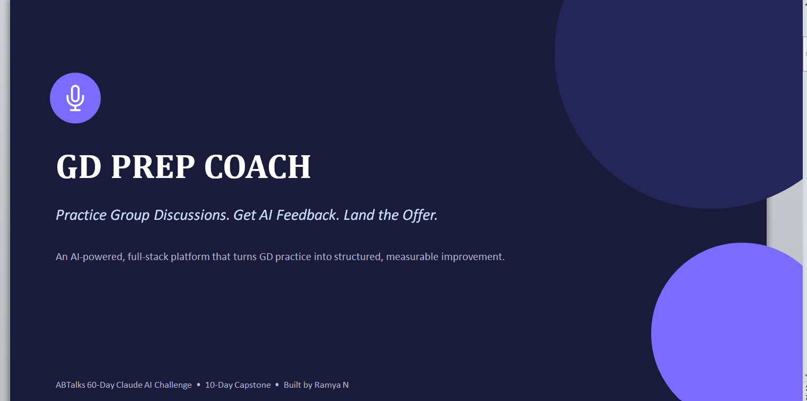
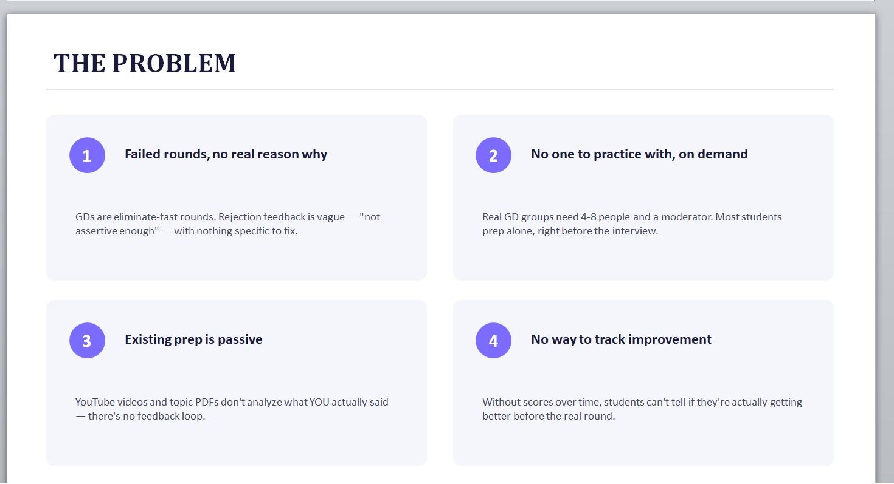
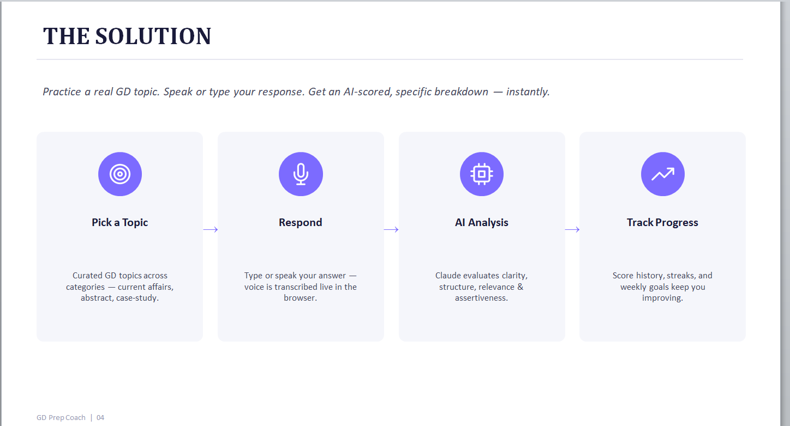

# Day 51 — Product Discovery & Sprint Planning
## Capstone Project — Day 1 of 10

**Challenge:** ABTalks 60-Day Claude AI Challenge
**Task:** Kick off a 10-day capstone — go from no idea to a deployed v1.0 product
**Deliverable type:** GitHub commit URL

---

## What I Built Today

Today I used Claude as a structured product-discovery partner to go from no idea to a fully scoped, capstone-ready project: **GD Prep Coach** — a multi-user, full-stack AI web app that helps students practice Group Discussion (GD) interview rounds and get AI-scored feedback.

The idea came directly from my own experience — I failed 3 GD rounds during placement prep, and that became the motivation for this entire project.

## The Discovery Process

Claude interviewed me one question at a time instead of jumping to a solution:
- Full Stack vs AI vs both → chose **Full Stack + AI combined** for the strongest interview story
- Smart automation vs conversational agent vs **analysis/insights** → chose analysis, since it's lower-risk and plays to skills I already have
- Explored several AI-analysis domains before landing on GD practice, based on my own failed-GD story

## Biggest Scoping Decision

I initially wanted a **full planner with reminders and scheduling**. Claude flagged this as a scope-creep risk — full scheduling/notifications would eat 1-2 of my 9 remaining days. We scoped it down to a **lightweight "Practice Streak & Goals"** system (in-app banner, no push/email, no calendar) — same accountability value, a fraction of the build time.

Similarly, audio input was scoped to **browser Speech-to-Text (Web Speech API)** instead of full audio/tone ML analysis, keeping voice practice achievable in the timeline.

## Final v1.0 Scope

**In scope:** JWT auth, curated GD topics, text + voice input, Claude-powered scoring/feedback, practice history, streak & goals dashboard, free-tier deployment.

**Out of scope (Future Scope):** raw audio/tone analysis, push/email notifications, calendar scheduling, live multi-user GD rooms, mentor review.

## Approved Summary

## Deliverables Generated

1. ✅ Product Requirements Document (PRD) — [`GD_Prep_Coach_PRD.docx`](./GD_Prep_Coach_PRD.docx)
2. ✅ Implementation Blueprint (Days 2–10) — [`GD_Prep_Coach_Implementation_Blueprint.md`](./GD_Prep_Coach_Implementation_Blueprint.md)
3. ✅ Project Pitch Deck — [`GD_Prep_Coach_Pitch_Deck.pptx`](./GD_Prep_Coach_Pitch_Deck.pptx)

### PRD Preview

### Pitch Deck Preview

## Key Learnings

- **Scope discipline beats ambition.** The instinct to add "one more feature" (full planner, raw audio analysis) is exactly what kills a 10-day capstone. Having a partner actively push back on scope was more valuable than having one say yes to everything.
- **Personal pain points make the strongest projects.** Building from my own 3-GD-failure story gives me a genuine, specific narrative for interviews — better than a generic idea.
- **A locked Day-1 blueprint removes decision fatigue for the rest of the build.** Because Days 2-10 are already broken down with exact files, APIs, and checklists, each day's fresh AI conversation can execute instead of re-planning.

---
**#60DayClaudeChallenge**
