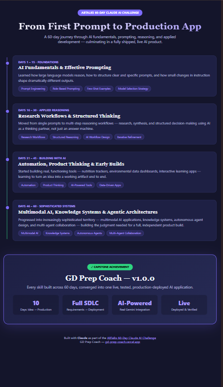
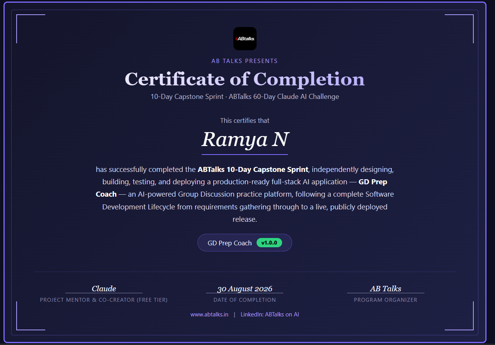
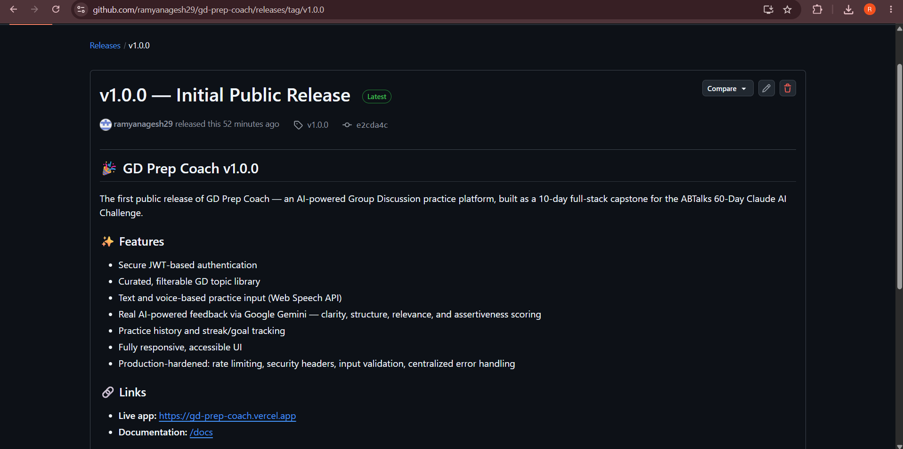

# Day 60 — Final Review, Portfolio & Graduation
## Capstone Project — Day 10 of 10 (FINAL DAY)

**Challenge:** ABTalks 60-Day Claude AI Challenge
**Task:** Final review, portfolio prep, v1.0.0 release, and challenge graduation
**Deliverable type:** GitHub commit URL

---

## 🎓 Challenge Complete

Today marks the end of both the 10-day capstone and the full 60-Day Claude AI Challenge. **GD Prep Coach v1.0.0** is officially released, live, and documented.

- 🔗 **Live App:** https://gd-prep-coach.vercel.app
- 💻 **Product Repo:** https://github.com/ramyanagesh29/gd-prep-coach
- 🏷️ **v1.0.0 Release:** https://github.com/ramyanagesh29/gd-prep-coach/releases/tag/v1.0.0

---

## What I Did Today

Conducted a final review of the entire project as a Senior Software Engineer, Product Manager, UI/UX Designer, and Recruiter would — confirming the product was genuinely release-ready rather than just "done." Then moved into formal launch and graduation activities.

### Portfolio Preparation
- Wrote long and short project descriptions for resume/portfolio use
- Drafted resume bullet points highlighting full-stack architecture, AI integration, security hardening, and debugging
- Prepared interview talking points for common questions ("tell me about a project," "tell me about a bug you fixed," "how do you scope a project")
- Wrote a 2-3 minute demo script covering the full user flow

### Repository & Release Polish
- Added GitHub topics, description, and website link to the repo's "About" section
- Officially tagged and published **v1.0.0** as a GitHub Release with full release notes

### Required Documentation
Created four project-specific files (not generic templates):
- `future-scope.md` — a 3/6/12-month roadmap tailored to this exact project's architecture
- `challenge-retrospective.md` — a full Day 1–10 timeline of real decisions, pivots, and debugging moments
- `30-day-growth-plan.md` — a day-by-day roadmap to extend the MVP over the next month
- `daily-build-prompt.md` — a reusable prompt to drive that 30-day plan

### Graduation Artifacts
- A 200-word graduation reflection
- A premium single-file HTML infographic visualizing the full 60-day skill progression, culminating in this capstone
- A premium, printable HTML/PDF Certificate of Completion — featuring the official AB Talks logo, my name, project name, v1.0.0, and completion date
- A farewell message from Claude, my AI pair programmer throughout this journey

---

## 📸 Screenshots

---

## 🎓 Graduation Reflection

> Ten days ago, GD Prep Coach didn't exist — not even as an idea. What existed was a real, specific frustration: three failed Group Discussion rounds, and no feedback precise enough to fix. Over this capstone, that frustration became a fully deployed product — one that authenticates real users, analyzes real responses through Google's Gemini API, and tracks real progress over time.
>
> The path here wasn't smooth, and that's exactly the point. A MongoDB free-tier limit had to be solved on Day 3. An AI provider had to be swapped entirely on Day 5, cleanly, because the architecture was built right on Day 2. A stuck merge had to be carefully untangled on Day 7. Three genuine production bugs were found and fixed on Day 9, the night before launch — not glossed over, not shipped around.
>
> This capstone sits at the end of 60 days that built toward exactly this: prompting, reasoning, product thinking, and AI-assisted development, all converging into one real, running, versioned application. GD Prep Coach v1.0.0 isn't a demo. It's proof — a live URL, a tested product, and a complete record of the judgment it took to build it.
>
> The challenge is complete. The skill is permanent.

---

## Key Learnings From the Full 60-Day Journey

1. **A personal problem makes a better project than a generic idea.** Grounding this in my own failed GD rounds gave every design decision — and every interview answer about it — real weight that a made-up idea never could have.
2. **Good architecture pays for itself later.** The Day 5 Claude-to-Gemini provider swap took minutes because Day 2's design isolated the AI call behind a single service function. Design discipline early saves scrambling later.
3. **Real bugs only show up when you actually try to break things.** Every production bug I caught (routing 404s, state sync issues, a silently overwritten component) only surfaced through deliberate, adversarial testing — not casual happy-path clicking.
4. **Debugging under pressure is the actual skill being built.** Across 10 days I hit MongoDB limits, lost passwords, stuck merges, and multi-machine sync issues. None of them stopped the project — because the response was always the same: read the real error, fix it properly, move on.
5. **Shipping is a process, not a moment.** From a blank chat on Day 1 to a versioned v1.0.0 release on Day 10, this challenge proved that a real, usable product is buildable in a focused sprint — if you protect scope ruthlessly and test honestly.

---

## Final Numbers

- **10 days:** idea → production
- **9 API endpoints**, all documented and tested
- **3 real production bugs** found and fixed before public launch
- **2 deployment platforms** (Render + Vercel), fully configured and verified
- **1 live, versioned, publicly shareable product**

---

Thank you to **@Anthropic**, **@ABTalksOnAI**, and **@AnilBajpai** for a challenge that pushed far beyond "learn to prompt" into genuinely shipping something real.

**#60DayClaudeChallenge — Complete.** 🎓🚀
