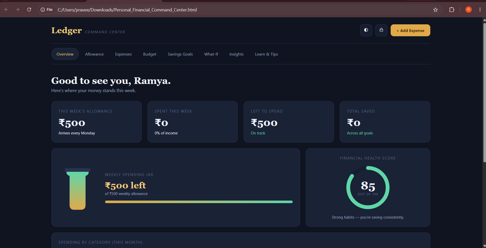
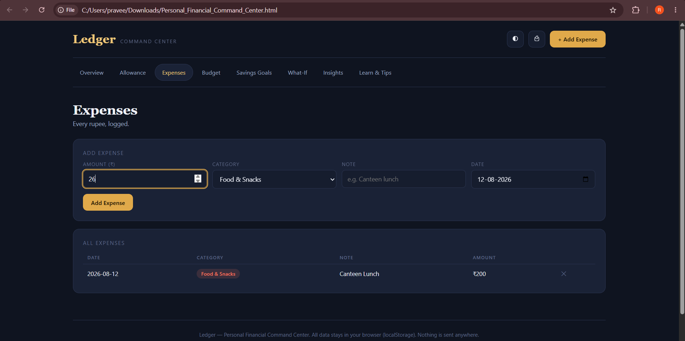
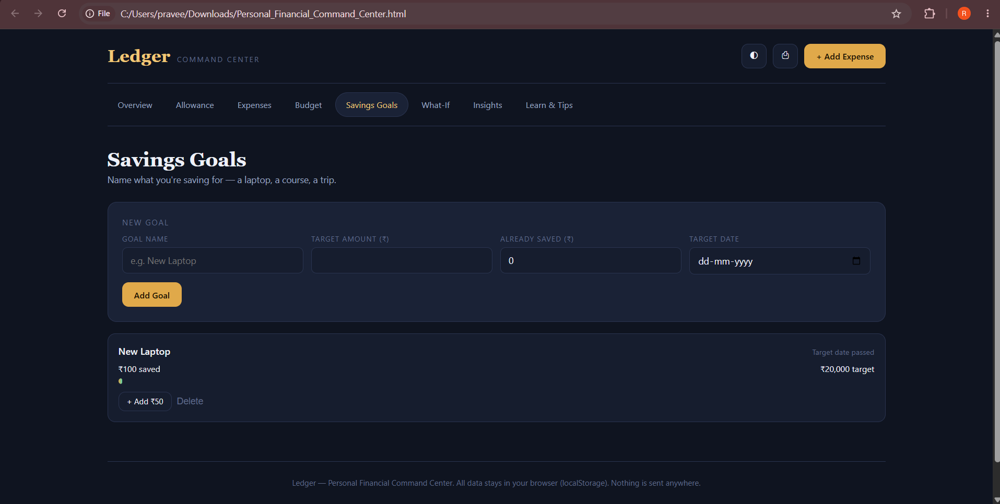
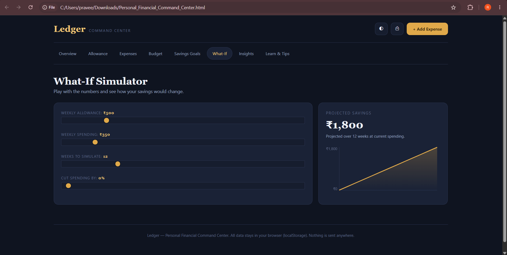
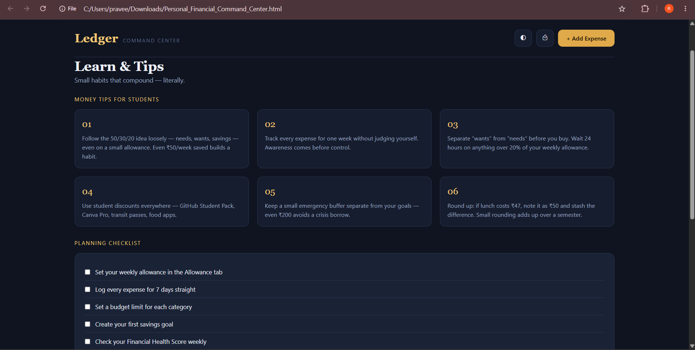

Day 42 — Personal Financial Command Center

🎯 Challenge

ABTalks 60-Day Claude Challenge — Day 42Build Personal Financial Command Center

I built Ledger — Personal Financial Command Center, a premium single-page financial dashboard designed to help users understand, manage, and improve their financial health instead of functioning as a basic expense tracker.

🚀 Project Overview

The application combines financial tracking, budgeting, savings goals, analytics, simulations, insights, and financial-learning resources in one interactive dashboard.

The project is built as a single self-contained HTML application using:

HTML

CSS

JavaScript

Browser LocalStorage

HTML Canvas for charts

All application data is stored locally in the browser. No backend or external framework is required.

✨ Key Features

1. Overview Dashboard

Weekly allowance summary

Weekly spending

Remaining amount

Total savings across goals

Weekly spending jar visualization

Financial Health Score

Monthly spending-by-category visualization

📸 Overview

2. Allowance Management

Set weekly allowance

Select the day the allowance arrives

Add extra income

View income history

3. Expense Tracking

Add expenses with amount, category, note, and date

Categories:

Food & Snacks

Transport

Fun & Outings

Study & Supplies

Other

View logged expenses

Delete expenses

📸 Expenses

4. Weekly Budget

Set category-wise weekly limits

Compare spending against category budgets

Visual progress bars

Highlight categories that exceed their limits

5. Savings Goals

Create a savings goal

Set target amount

Enter amount already saved

Set a target date

Track progress visually

Add ₹50 toward a goal

Delete goals

📸 Savings Goals

6. What-If Simulator

The What-If Simulator allows users to experiment with:

Weekly allowance

Weekly spending

Number of weeks

Spending reduction percentage

The dashboard then calculates projected savings and displays the result through a visual chart.

📸 What-If Simulator

7. Financial Insights

The dashboard generates rule-based personalized insights from the user's entered financial data.

Examples include:

Identifying the biggest spending category

Detecting spending above weekly income

Warning when a category exceeds its budget

Showing savings-goal progress

Suggesting a savings goal when none exists

8. Learn & Tips

The application includes:

Student-focused money tips

Financial planning checklist

Financial literacy resources

Prompts for improving financial knowledge

📸 Learn & Tips

🖥️ Dashboard Showcase

Ledger Dashboard

🛠️ Technical Implementation

HTML

Used for:

Dashboard structure

Navigation tabs

Forms

Tables

Cards

Progress indicators

Canvas elements

Interactive controls

CSS

Used for:

Premium financial-dashboard UI

Dark/light themes

Responsive layouts

Cards and progress bars

Smooth transitions and animations

Print-friendly styles

JavaScript

Used for:

Application state management

LocalStorage persistence

Expense and income operations

Budget calculations

Savings-goal calculations

Financial Health Score calculation

What-If simulation

Canvas charts

Dynamic insights

Theme switching

Printing

Navigation between modules

💾 LocalStorage

The application stores its state in the browser using LocalStorage.

This allows data such as:

Allowance

Income

Expenses

Budgets

Savings goals

Checklist progress

Theme preference

to remain available after refreshing the page.

📊 Financial Health Score

The dashboard calculates a score from 0–100 using factors such as:

Weekly spending compared with income

Whether savings goals exist

Progress toward savings targets

Whether category budgets are configured

The score provides a quick visual indication of the user's current financial habits.

🔮 What-If Financial Simulation

The simulator demonstrates how changing financial behaviour can affect projected savings.

For example, a user can:

Set weekly allowance.

Set weekly spending.

Choose the number of weeks.

Reduce spending by a percentage.

Compare the projected savings.

This makes the dashboard more useful for financial planning rather than only recording past expenses.

🧠 What I Learned

How to design a complete financial dashboard instead of a simple expense tracker.

How different financial modules can share a common application state.

How JavaScript can dynamically calculate and update financial summaries.

How localStorage can persist application data without a backend.

How to create charts using the HTML Canvas API without external chart libraries.

How to build a What-If financial simulation using user-controlled variables.

How to calculate and visualize a Financial Health Score.

How to generate rule-based financial insights from user-entered data.

How responsive CSS and reusable UI patterns improve dashboard usability.

How to create print-friendly styles for financial reports.

💡 Key Takeaway

The biggest learning from this challenge was that a useful financial application should go beyond simply tracking expenses.

It should help answer:

Where is my money going?

Am I staying within my budget?

How close am I to my savings goal?

What happens if I reduce my spending?

How healthy are my current financial habits?

Combining tracking + budgeting + goals + analytics + simulations + insights creates a much more useful financial command center.

📸 Project Screenshots

Overview Dashboard

Expenses

Savings Goals

What-If Simulator

Learn & Tips

📁 Project Structure

Day42/
├── day42.md
├── Personal_Financial_Command_Center.html
├── Overview.png
├── Ledger-dashboard.png
├── Expenses.png
├── Savings-Goals.png
├── What-If.png
└── Learn-Tips.png

🔗 Challenge

ABTalks 60-Day Claude Challenge — Day 42Build Personal Financial Command Center

#60DayClaudeChallenge #ANTHROPIC #ANILBAJPAI #ABTALKSONAI
